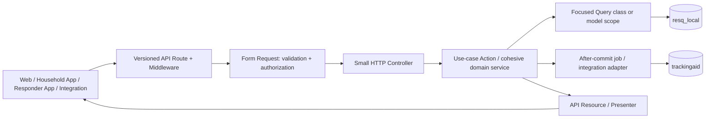

# RESQPERATION Backend Refactor Plan

**Status:** partial local implementation. A1–A3 still have gaps documented in `A1_A3_ARCHITECTURE_AUDIT.md`. B1 archive CSV streaming is implemented locally; B2 list-read findings are documented in `B2_LIST_QUERY_AUDIT.md` and require follow-up. Shared-database validation remains deferred. See `REFACTOR_REPORT.md` for local verification.

**Baseline:** Laravel 13.12, PHP ^8.3, SQLite in-memory for PHPUnit, operational database connection `resq_local`, separate integration connection `trackingaid`.

**Compatibility rule:** preserve route paths, HTTP methods, input names, authorization, status codes, and JSON/CSV contracts unless a separately approved API change explicitly updates every web/mobile client.

## 1. Goal and success criteria

The goal is a backend that is understandable by domain, safe under concurrent writes, bounded in memory and query size, diagnosable when the shared database is unreachable, and testable without operational data.

Completion means:

- Each high-risk API workflow has a route-to-query/write/response map and automated contract coverage.
- Services coordinate cohesive use cases; query construction, data transformation, and external delivery have clear owners.
- Core schema errors fail visibly and safely; optional integrations have explicit handling.
- Every list/feed has an intentional bound or pagination strategy. Map and dashboard payloads are intentionally bounded/aggregated rather than blindly paginated.
- Exports stream bounded chunks with documented maximums and stable ordering.
- Critical multi-row writes have defined transaction boundaries, tested rollback behavior, and targeted locks only where concurrency requires them.
- Index migrations are backed by representative `EXPLAIN` evidence and are reviewed against a database copy before deployment.
- Operations can distinguish app liveness, operational DB readiness, integration failures, schema errors, and ordinary query errors without exposing credentials or household personal information.
- The full local suite passes, client smoke tests pass in a staging/copy environment, and each implementation slice has a reviewable commit.

## 2. Current baseline and caveats

### Largest service files

Physical line counts are the file line counts. Nonblank LOC counts exclude blank lines and should not be confused with total physical lines. The earlier audit initially labeled nonblank LOC as line counts; `REFACTOR_REPORT.md` now contains the corrected measurements.

| Service | Physical lines | Nonblank LOC | Main work areas to map |
|---|---:|---:|---|
| `RescuerMobileService` | 2,213 | 1,880 | responder profile/setup, assignment feed/status, locations/routes, field reports, check-ins, resource requests, radio |
| `HouseholdMobileService` | 2,176 | 1,841 | overview/setup, household/member status, device/location, status history, trusted households |
| `ArchiveService` | 1,713 | 1,498 | six archive categories, filtering/formatting, CSV export, saved groups, deletion |
| `RescueDispatchService` | 1,549 | 1,352 | team/assignment listing, create/update/complete, routing/location, notifications |
| `ResourceRequestService` | 1,503 | 1,307 | admin lifecycle, external intake, validation, fulfillment, forwarding |
| `RescuerAccountService` | 1,424 | 1,226 | responder accounts, teams, validation/deactivation |
| `HouseholdStatusService` | 1,391 | 1,225 | household listing/detail, status confirmation/logs, member/device enrichment |
| `DisasterBroadcastService` | 922 | 781 | event lifecycle, broadcast persistence, SMS/push delivery |
| `MappingService` | 813 | 695 | overview/map layers, filters, stored routes and geotags |
| `SituationReportService` | 781 | 683 | report creation and event-derived snapshots |
| `DashboardService` | 749 | 651 | summary aggregates, activity and active-event closing |
| `NotificationService` | 635 | 556 | feed construction, status changes and audit |

All service physical line counts are available in `REFACTOR_REPORT.md`.

### Work already present on `refactor/backend-hardening`

- Baseline audit, hygiene, pagination helper for selected paginator-backed collections, archive export row-ceiling compatibility, and health/readiness diagnostics were implemented and locally tested.
- The audit's broad formatter/query/service/transaction/export/index steps remain unimplemented. This plan schedules them; it does not claim those steps are finished.
- Pagination was only applied to selected existing paginator routes. Before expanding it, recheck current defaults: `ListRequest` currently supplies page 1 / per_page 15, while previous endpoints had different defaults (for example archive, household, dispatch, and inquiry). Decide whether to preserve each endpoint's prior default or coordinate the changed default with all clients.
- `resq_local` readiness is implemented; `trackingaid` readiness remains a product/operations decision.
- SQL dumps were untracked and ignored while local copies were preserved. `debug_auth.php` and the shortcut file were removed from the worktree. Previously committed history still contains tracked data artifacts; assess credential rotation/history handling separately if that history was shared.
- Preserve unrelated working-tree changes; do not stage them with backend refactor slices.

### Database and API constraints

- Never use the remote/shared database for automated tests, migrations, seeders, EXPLAIN, benchmark writes, or destructive checks.
- Until there is an explicitly approved staging copy, use SQLite in-memory or a disposable local database only. User-directed local operational database access may be used for read-only schema inspection and query plans; do not read personal records or write operational data during refactors.
- `resq_local` is the operational store. `trackingaid` is a separate integration connection. No transaction may span them.
- The checked-in Laravel migrations do not fully document all legacy operational tables. Build a sanitized schema inventory from a database copy or an approved schema-only export before removing runtime compatibility checks or authoring schema-dependent migrations.
- Web, household mobile, and responder mobile depend on existing response structures. Save before/after JSON and CSV contract fixtures before each behavior-adjacent refactor.

## 3. Target request and data flow

### Responsibility rules

| Layer | Owns | Does not own |
|---|---|---|
| Route/middleware | URL, HTTP method, authentication, role, throttling | business rules or data formatting |
| Form Request | input validation and request-level authorization | multi-table business workflow |
| Controller | translate HTTP request to use-case call and HTTP response | large query construction or dozens of response-format helpers |
| Action/domain service | one cohesive business operation and its transaction orchestration | CSV serialization or generic JSON parsing for unrelated domains |
| Query class | complex read query, selected columns, joins, filters, eager-loading plan | writes or response labels |
| Model/local scope | model behavior, stable reusable predicates, casts, relationships | all page-specific SQL regardless of ownership |
| API Resource | stable model-to-JSON contract | query execution or external calls |
| Presenter | computed display output shared by API/export/report where appropriate | persistence or HTTP validation |
| Integration adapter/job | SMS, OneSignal, weather/routing/TrackingAid calls and retry policy | operational DB transaction spanning a network call |

Do not create one Resource/Presenter for every service as a goal. Create one when there is a stable response boundary worth naming. Do not add repositories for every model; retain the current `HouseholdRepository` and add a repository only when it establishes a concrete persistence boundary.

## 4. Execution sequence and gates

Each phase is a bounded implementation slice. The implementation work should be done one phase at a time, with a report update and commit per phase. A phase cannot pass its gate by saying “the files are shorter”; it must preserve behavior and demonstrate the relevant safety/performance improvement.

### Phase 0 — Protect the baseline and workspace — complete locally

**Tasks**

1. Confirm branch and working tree. Keep unrelated mapping edits and the untracked `HqPersonnelSeeder.php` out of refactor commits.
2. Keep `.env`, SQL data dumps, API tokens, household/responder personal data, and generated logs out of source control/output.
3. Record exact Laravel/PHP/database-driver versions for local tests and deployment.
4. Keep `REFACTOR_REPORT.md` as findings/history and this file as the planned implementation sequence.

**Gate:** cleanly scoped diff; no operational DB target in test config; current test result recorded.

### Phase 1 — Reproduce and classify the remote DB failure

**Tasks**

1. In browser DevTools, record the failing request path/method, status, response JSON, and request ID. Redact authorization headers and personal data.
2. Match the request ID/time to Laravel logs. Identify the configured connection name and exception class/code without printing `.env` values.
3. Classify the failure: DNS/host, network/port/firewall/allowlist, credentials/grants, TLS/CA/hostname, stale config cache, schema mismatch, slow query/timeout, or application error.
4. Check `GET /up` (app liveness) separately from `/api/v1/health/ready` (current `resq_local` readiness).
5. Use only an approved diagnostic process for the remote database. This plan does not authorize remote connections or remote schema operations. Until that approval exists, diagnose with provider configuration, app logs, and local/dedicated staging replicas.
6. Verify deployed `APP_DEBUG=false`, effective config cache lifecycle, connect/read timeout values, and provider-specific TLS requirements.

**Deliverable:** sanitized incident note with observed evidence and the smallest next fix. “Backend down” alone is not a diagnosis.

**Gate:** a single verified failure category; no credentials or household data in diagnostics.

### Phase 2 — Canonical schema and connection map

**Tasks**

1. Inventory API route → controller → service/action → model/query → table → connection.
2. For each table record: owner domain, connection, primary key, join keys, status fields, JSON columns, nullability, indexes, and whether it is core or optional.
3. Compare migrations, model expectations, seeders, and a sanitized schema-only copy. Mark uncertain legacy assumptions explicitly.
4. Document cross-system writes as separate operations: operational persistence first; TrackingAid forwarding afterward with idempotency/retry/error state. Never claim cross-connection atomicity.
5. Decide whether schema drift is solved with forward migrations, an adapter for legacy schemas, or an approved consolidation. Do not silently preserve every historical column variant forever.

**Deliverable:** versioned schema/connection map and a migration compatibility matrix.

**Gate:** every table used by a first-slice workflow has a verified schema contract.

### Phase 3 — Contract and fixture foundation

**Tasks**

1. Create focused feature fixtures/factories for the real domain relationships, initially using local SQLite where the schema is compatible.
2. Pin success, validation failure, unauthenticated, unauthorized, not-found, database-failure, and relevant conflict responses.
3. Capture exact JSON keys, nesting, null behavior, dates, status labels, pagination metadata, and ordering. Capture CSV headers and row order for exports.
4. Add transaction failure tests for a representative multi-table write.
5. Add query-count measurements for representative dashboard, archive, household, dispatch, and mobile routes only after fixtures are repeatable.

**Deliverable:** repeatable tests independent of remote operational data.

**Gate:** a refactor cannot start on a route until its current contract and write invariants are pinned.

### Phase 4 — Query bounds and API collection policy

**Tasks**

1. Inventory every endpoint that returns a growing collection; separate lists from dashboards, maps, lookup options, detail relationships, and exports.
2. For tables, choose a pagination strategy: `paginate` when total/page links are required, `simplePaginate` when totals are unnecessary, cursor pagination for large ordered feeds.
3. Define `page >= 1`, `per_page >= 1`, documented default, and a hard maximum (initially 100 is reasonable). Validate HTTP input and clamp internal service callers.
4. Decide defaults endpoint by endpoint. Current `ListRequest` default 15 may differ from legacy defaults; pin client expectations before standardizing.
5. For map layers, use a deliberate max point/viewport/area policy; do not paginate away pins the map expects in one response.
6. For dashboards, use SQL aggregates and a limited recent-activity window. For lookup lists, document a small max or cache stable reference data.
7. Ensure pagination count queries and filters are indexed only after Phase 8 evidence.

**Deliverable:** endpoint matrix with strategy, default, cap, response metadata, and client caller.

**Gate:** no public list can request an unbounded result, and the JSON structure remains compatible.

### Phase 5 — Read-path cleanup: one endpoint at a time

**Tasks per route**

1. Record current query count, latency, rows returned, and query plan on a local sanitized fixture.
2. Move reusable, model-local predicates into scopes. Put complex page joins/filter assembly into a narrowly named Query class.
3. Replace N+1 access with eager loading/`withCount()` where that yields the needed columns and preserves semantics.
4. Select only required columns, retain stable ordering and tie-break keys, and avoid loading all rows to count/filter in PHP.
5. Keep map/dashboard response contracts as designed payloads; do not force Resource pagination wrappers into them.
6. Compare query count/plan/output and document the measured delta.

**Initial read slices:** archive category queries; household registry and member/device enrichment; dispatch list; resource request list; dashboard aggregates; mapping overview/layers; global search.

**Gate:** tests unchanged, query plan/measurement documented, no unbounded load introduced.

### Phase 6 — Response resources and formatters

**Tasks**

1. Separate response formatting from data acquisition one route at a time.
2. Use Laravel API Resources for model/collection JSON. Use explicit collection resources only where custom metadata is needed.
3. Use small Presenters for computed labels/date/status text shared by API, CSV, or reports.
4. Keep audit serialization distinct from API presentation; audit JSON storage is persisted data and needs its own compatibility contract.
5. Preserve Laravel resource wrapping behavior intentionally; don’t accidentally add/remove a top-level `data` key.
6. Use conditional relationship output only when loaded; ensure queries eager-load what a Resource needs to avoid hidden N+1 queries.

**Candidate domains:** `HouseholdStatus`, `RescueDispatch`, `ResourceRequest`, `Archive`, then mobile response payloads after exact tests.

**Gate:** byte/structure-equivalent JSON where required; no DB query in Resource transformation.

### Phase 7 — JSON casts and schema compatibility policy

**Tasks**

1. Classify every JSON call: persisted JSON column, JSON text embedded in notes, provider payload, route polyline, audit before/after values, API output, or temporary encoding.
2. Add Eloquent casts only to columns confirmed to contain compatible JSON for all supported rows. Define behavior for null, malformed, and legacy scalar payloads.
3. Avoid a generic manager for unrelated payload formats. Use a value object/cast when the same structured column has a stable schema; use a domain decoder when formats differ.
4. Classify each runtime schema check as required core table, optional feature/integration, or legacy-compatibility probe. Remove checks only for schema guaranteed by the verified deployment baseline.
5. Core schema mismatch should log a safe diagnostic and fail as an operational error; do not return fake empty-success payloads.
6. Introduce `ArchiveGroupManager` only for archive group operations: request payload validation, archive group persistence/retrieval, and numbering/sequence semantics. Keep CSV category queries and unrelated page JSON outside it.

**Gate:** migration/schema evidence, malformed/legacy payload tests, and exact client output fixtures pass.

### Phase 8 — Write workflows, transactions, and concurrency

**Tasks per write use case**

1. List the tables written, current connection for each, transaction scope, audit writes, and external side effects.
2. Put related same-connection DB writes in one short transaction. Add retry attempts only after proving the closure is safe to re-execute.
3. Dispatch SMS/push/HTTP/routing/TrackingAid after commit or through a job; make delivery idempotent and observable.
4. Use `lockForUpdate()` only for a specific row that must serialize competing changes, inside the active transaction. Lock in a consistent table/row order.
5. Prefer auto-increment/unique constraints or a dedicated sequence row to `MAX()+1`; test concurrent allocation if a sequence is necessary.
6. Add failure injection after each critical write to prove rollback leaves no partial operational state.
7. Never pretend the operational DB and TrackingAid can commit atomically. Use an outbox/status/retry workflow if forwarding must be reliable.

**Priority writes:** dispatch create/complete; household/member status and logs; resource request transitions; archive saved group numbering/deletion; disaster event/broadcast save vs notification delivery; responder location/report/check-in writes.

**Gate:** rollback tests pass; external calls cannot occur twice because of automatic transaction retry; connection boundaries are documented.

### Phase 9 — Archive export streaming

**Tasks**

1. Characterize each of the six CSV categories separately: source query, selected fields, headers, order, filters, authorization, row ceiling, and count header.
2. Pick a stable key and ordering for each category. If the export uses joins or non-monotonic ordering, prove `chunkById()` is correct or use explicit keyset pagination.
3. Use response streaming and a bounded chunk (start around 500, then measure); write each CSV row as it is read instead of accumulating all records or a PHP temp string.
4. Keep the 1,000-row compatibility ceiling initially or make the larger export an explicit async job. Require a date range for unbounded historical export if needed.
5. Keep CSV formatting in a reusable Presenter/row formatter with no DB access.
6. Test headers, row order, escaping, UTF-8, empty export, exact limit, and the limit + 1 case.

**Gate:** peak memory remains bounded by chunk size, response contract is pinned, and request timeout risk is measured.

### Phase 10 — Indexes and search

**Tasks**

1. Capture representative query plans for common filters, joins, and sorts from Phases 4–5.
2. Inspect existing indexes and cardinality. Prioritize selective join/filter keys and actual compound query patterns; do not create one index per column mechanically.
3. Review write-heavy status, location, device, and log tables for insert/update overhead.
4. Replace `%term%` search only if product semantics permit it. Prefix search and FULLTEXT are not equivalent; define tokenization and matching behavior first.
5. Write one reversible migration per affected table, include index names, and document the query each index supports.
6. Run migrations only on a disposable local DB or approved staging copy. Review rollback, lock duration, disk capacity, and provider online-DDL support before production.

**Gate:** `EXPLAIN` before/after and representative response/performance evidence attached to each migration review.

### Phase 11 — Operational diagnosis and deployment

**Tasks**

1. Keep `/up` liveness independent of database availability. Keep readiness checks limited to required dependencies and low-cost queries.
2. Decide whether TrackingAid belongs in readiness or only in a feature-specific health/forwarding status.
3. Add correlation/request ID end-to-end across API response, logs, and client error report.
4. Log error class, safe SQLSTATE/native code, route name, connection name, and timing. Do not log exception SQL/bindings if those may contain household data.
5. Review DB connect/read timeouts and TLS CA/hostname verification against the managed provider. No `verify=false` in production.
6. Deploy config changes with config cache rebuilt. Keep `APP_DEBUG=false` in production.
7. Smoke-test in a staging/copy environment before a production schema change.

**Gate:** liveness/readiness behavior tested during DB outage; safe error response verified; deployment checklist signed off.

## 5. Domain work packages

Each package follows the same cycle: map → contract tests → one extraction → full suite → output comparison → commit/report.

### 5.1 Rescuer mobile (`RescuerMobileService`, 2,213 physical lines at baseline)

Map route methods to distinct operations: profile/setup, assignments/status, responder location/routes, field reports, check-ins, resource requests, and radio feed/transmission/clip/signal. Identify which data is owned by `RescueDispatchService` vs only exposed by mobile. Extract only cohesive use cases and read queries; keep responder authorization in the request boundary. Check radio/location feeds for bounds and ordering. Keep route generation outside DB transactions; persist route/state only after successful route policy is clear.

**A1 status:** implemented locally as of 2026-09-30. The facade is 165 physical lines; extracted workflows and read queries are documented in `REFACTOR_REPORT.md`. Tests use SQLite in-memory. The broader service package and staging-client verification remain outstanding.

### 5.2 Household mobile (`HouseholdMobileService`, 2,176 physical lines at baseline)

Separate overview/setup, household status report, per-member status report, member profile changes, device location/token, history, and trusted-household features. Map all status/log/device tables and event linkage. Prove household ownership authorization for every `householdId`/`memberId`. Treat JSON-encoded notes and member relationship payloads as distinct formats unless schema proves they share a castable JSON column.

**A1 status:** implemented locally as of 2026-09-30. The service is a 62-line facade; the response Presenter and workflow/query classes are documented in `REFACTOR_REPORT.md`. The broader package remains in progress for the other large services.

### 5.3 Archive (`ArchiveService`, 1,713)

Separate archive category read queries/formatters, saved-group operations, and exports. `ArchiveGroupManager` owns only groups and their sequence/storage contract. Review current arbitrary schema probes against the canonical schema map. Preserve all CSV columns/filters/limits and archive record semantics. Ensure delete and save group operations have explicit transaction and audit behavior.

### 5.4 Rescue dispatch (`RescueDispatchService`, 1,549)

Separate dispatch list query, create action, update/status action, completion action, location/route update, and team-availability query. Document allowed state transitions and whether assigning multiple responders creates multiple rows. Lock only rows involved in concurrent team/assignment allocation. Push notification must follow a committed assignment and handle delivery failure without rolling back the assignment.

### 5.5 Resource requests (`ResourceRequestService`, 1,503)

Separate admin lifecycle, rescuer lifecycle if shared, external request intake, validation/return/complete, and integration forwarding. For TrackingAid, document request IDs, idempotency keys, duplicate handling, retries, and statuses across both connections. No cross-database transaction. Ensure public intake authorization/throttling and payload validation stay stable.

### 5.6 Rescuer accounts (`RescuerAccountService`, 1,424)

Separate responder CRUD/status from team configuration and credential provisioning. Verify unique login/account rules and whether responder/user creation is same-connection transactional. Ensure credential hashing and audit writes remain centralized and response payloads never expose hashes/tokens.

### 5.7 Household status (`HouseholdStatusService`, 1,391)

Separate collection query, household detail query, status history, confirmation/report action, and member/device enrichment. Address N+1 patterns with a query-count test. Keep the status-of-record policy explicit when household-level and member-level status differ.

### 5.8 Remaining large services

Review `DisasterBroadcastService`, `MappingService`, `SituationReportService`, `DashboardService`, and `NotificationService` after the first seven. Broadcast is split into event persistence, message persistence, and delivery orchestration; map and dashboard use dedicated read queries; SitRep snapshot creation remains a domain operation; notification delivery remains separate from notification-feed formatting.

## 6. Standard work ticket template

For each endpoint/use case create a ticket with:

1. **Route/client:** method, path, caller(s), auth/role, filters/body fields.
2. **Contract:** current success/error JSON or CSV fixture and status codes.
3. **Data:** tables, connection per query/write, required schema, row counts, indexes.
4. **Behavior:** validation, authorization, business invariants, state transitions.
5. **Side effects:** SMS, push, weather/routing, TrackingAid, queue jobs.
6. **Concurrency:** rows locked, uniqueness relied on, transaction/retry policy.
7. **Performance baseline:** query count, elapsed time, returned rows, peak memory for export.
8. **Proposed change:** one cohesive extraction only.
9. **Verification:** tests, contract comparison, query plan/performance evidence.
10. **Rollback/deploy:** migrations, feature flags, config changes, manual smoke test.

## 7. Global AI implementation prompt

Use this safety preamble for future code turns:

> Work in `backend-laravel` only for this task. Start read-only and inspect repository instructions, branch, and working tree. Do not overwrite or stage unrelated user changes. Do not connect to, migrate, seed, or write to the remote/shared database. Never print or commit secrets, SQL dump contents, tokens, passwords, or personal household/responder data. Preserve route paths, HTTP methods, input names, authorization, status codes, and JSON/CSV structure. Before editing an endpoint, trace its callers, current response, tables/connections, transaction boundary, and external effects; add or update local tests first. Make one bounded change, run the full local test suite against SQLite in-memory or a disposable local DB, inspect the diff, update `REFACTOR_REPORT.md`, and commit only the files for this phase. If schema or behavior is uncertain, stop that slice, document the exact missing evidence, and continue only with independent safe planning.

## 8. Copy-ready prompts by phase

### Endpoint mapping, read only

> Do not edit code or connect to any database. For `[route]`, trace route → middleware → controller → service → models/queries → tables and connections → external calls → response. List every method involved, output fields, sort/filter rules, transaction blocks, and likely N+1/unbounded reads. Distinguish confirmed facts from hypotheses. Do not display secret values or personal records. Return a concise route contract and data-flow diagram.

### Build a characterization test

> Add local feature tests for `[route]` using only a fixture schema in SQLite in-memory or the configured disposable test DB. Pin current status codes, authorization behavior, exact JSON keys/nesting/nulls/date formats/pagination metadata/order, and relevant side effects. Do not change production behavior or call external providers. If the schema cannot be safely represented from the checked-in model/migration/source contract, report which schema evidence is missing rather than inventing fields.

### Extract one Resource or Presenter

> Refactor response formatting for `[route]` only. First show the current response fixture and identify which values are persisted domain data vs display labels. Propose whether an API Resource or Presenter is appropriate. Preserve the exact response contract and avoid queries inside the transformer. Implement only after the current contract test passes; then compare output fixture and run the full local suite.

### Extract a query

> Review `[route]` query only. Classify each predicate as a reusable model scope, page-specific query-object concern, or one-off condition. Identify joins that cannot safely become relationships, selected columns, N+1 risks, result bounds, and needed indexes. Do not edit until the endpoint fixture and query plan baseline are available. Do not add a repository unless it establishes a real persistence boundary.

### Split a service by use case

> Plan a split of `[ServiceName]` without code edits. Group public methods into business workflows and map private helpers to their callers. For each group report input, authorization, reads/writes, connections, transactions, external calls, response formatter, and test coverage. Propose one first extraction with minimal behavior change. Do not create one class per method or target an arbitrary line count.

### JSON/schema audit

> Audit JSON encode/decode and runtime schema probes for `[service/domain]` without editing. For each match classify it as persisted JSON column, text-in-JSON legacy field, provider payload, API serialization, audit serialization, or temporary data. Identify exact table/column/connection evidence needed for casts or check removal. Separate core schema from optional integration/legacy compatibility. Do not connect to a remote DB or print data.

### Transaction/locking review

> Review write operation `[operation]` without editing. Enumerate tables and connection for every write, external side effects, current transaction boundary, invariants, uniqueness constraints, sequence logic, and concurrent requests. Recommend the smallest transaction and any specific row lock. Explain retry safety and lock order. Propose rollback/concurrency tests using local fixtures only. Never use `lockForUpdate()` without naming the row and race it prevents.

### Export streaming

> Review export category `[category]` without editing. Capture current CSV headers/order/filter/authorization/maximum and stable key. Propose bounded streaming/chunking that preserves those outputs; state why `chunkById`, keyset pagination, or a queued export is appropriate. Include empty, max, max+1, quoting, and Unicode tests. Do not run an export against a remote database.

### Index proposal

> Given this sanitized schema/index list, query and EXPLAIN plan for `[endpoint]`, propose at most the smallest useful indexes. Explain composite order, selectivity, sort support, write overhead, existing duplicate indexes, migration rollback, and how to verify on a copy. Do not make or run migrations and do not connect to the shared DB.

## 9. Release checklist

### Before a slice is merged

- [ ] No remote DB use; tests use a disposable local target.
- [ ] Exact route/API contract fixture passes.
- [ ] Authorization and household/responder ownership checks remain in place.
- [ ] No new unbounded collection, JSON parse surprise, N+1, or response-time external call.
- [ ] Transaction operates on one connection; retry closure is safe; external effects happen after commit.
- [ ] Query plans/index evidence attached if a query/index changed.
- [ ] Full backend test suite passes; frontend/mobile callers smoke-tested when output behavior could affect them.
- [ ] `REFACTOR_REPORT.md` and this plan status are updated; commit excludes unrelated files.

### Before production DB migration/deploy

- [ ] Backup and restore procedure tested.
- [ ] Migration reviewed/applied on a copy with realistic size.
- [ ] Lock duration, disk/index growth, rollback feasibility, and provider online-DDL behavior reviewed.
- [ ] Deployed connection host, grants, CA/TLS, timeout, config cache, and `APP_DEBUG=false` verified securely.
- [ ] Liveness and required readiness endpoints checked.
- [ ] Manual smoke tests cover dashboard, archive/export/groups, broadcasts, dispatch lifecycle, household status, resource lifecycle/forwarding, household app status, responder assignments/reports/radio, map, and auth.
- [ ] Rollback/recovery contact and logs/request IDs are available.

## 10. Study sources (official / primary)

### Laravel 13

- [Eloquent API Resources](https://laravel.com/docs/13.x/eloquent-resources)
- [Eloquent casts](https://laravel.com/docs/13.x/eloquent-mutators#attribute-casting)
- [Eloquent relationships and local scopes](https://laravel.com/docs/13.x/eloquent)
- [Query builder chunking](https://laravel.com/docs/13.x/queries#chunking-results)
- [Pagination](https://laravel.com/docs/13.x/pagination)
- [Migrations](https://laravel.com/docs/13.x/migrations)
- [Form Request validation](https://laravel.com/docs/13.x/validation#form-request-validation)
- [Database transactions, multiple connections, and locks](https://laravel.com/docs/13.x/database)
- [Database testing](https://laravel.com/docs/13.x/database-testing)
- [HTTP tests](https://laravel.com/docs/13.x/http-tests)
- [Error handling](https://laravel.com/docs/13.x/errors)
- [Logging](https://laravel.com/docs/13.x/logging)
- [Configuration](https://laravel.com/docs/13.x/configuration)
- [Deployment and health route](https://laravel.com/docs/13.x/deployment#the-health-route)

### MySQL 8.4 / operational practices

- [MySQL connection troubleshooting](https://dev.mysql.com/doc/refman/8.4/en/problems-connecting.html)
- [MySQL TLS/encrypted connections](https://dev.mysql.com/doc/refman/8.4/en/encrypted-connections.html)
- [MySQL indexes](https://dev.mysql.com/doc/refman/8.4/en/optimization-indexes.html)
- [MySQL `EXPLAIN`](https://dev.mysql.com/doc/refman/8.4/en/using-explain.html)
- [InnoDB deadlocks and safe retries](https://dev.mysql.com/doc/refman/8.4/en/innodb-deadlocks.html)
- [The Twelve-Factor App: configuration](https://12factor.net/config) and [logs](https://12factor.net/logs)

#### 5.3 Archive (`ArchiveService`, 1,713 physical lines at baseline)

**A1 status:** implemented locally on 2026-09-30. `ArchiveService` is a 57-line facade. Category reads are in `ArchiveQuery`; event display shaping and detail reads are in `ArchiveEventPresenter` / `ArchiveEventDetailQuery`; saved group, deletion, and CSV export responsibilities are in their corresponding workflow classes. `ArchivePresenter` owns display transformations. The local suite passes (39 tests, 129 assertions), including saved-group payload characterization. Continue to the other four oversized services before calling the broader A1 work complete.

**A1 status:** implemented locally on 2026-09-30. `RescueDispatchService` is 265 lines; query, presenter, and write workflow collaborators own the extracted responsibilities. Route/controller contracts remain unchanged. Full SQLite in-memory suite passes (41 tests, 137 assertions), including dispatch presenter characterization.

#### 5.8 Oversized-service execution status — 2026-09-30

The first-pass refactor of every service above 1,000 lines is complete locally. `RescuerMobileService` is a 199-line facade; `RescuerAccountService` is a 103-line facade with query, presenter, account/team workflows, support validation, and audit logger collaborators. `HouseholdStatusService` is now a 103-line facade with query, presenter, and report/confirmation workflow collaborators. See `REFACTOR_REPORT.md` for all seven facade sizes and extracted responsibilities. The full local SQLite in-memory suite passes: 47 tests, 166 assertions. Shared-database and deployment checks remain outside this local refactor task. The next group of services (all currently below 1,000 lines) is a separate follow-up, not part of this completed oversized-service batch.

### Query objects, repositories, and service grouping

Keep `app/Queries` for complex, page-specific reads; put small reusable predicates on model scopes. Repositories are reserved for the existing aggregate persistence boundaries and should not duplicate query-object responsibilities. Do not add model-by-model repositories without a concrete boundary need. Services coordinate use cases, write workflows/actions own transactions, and Resources/Presenters own response shaping. Laravel does not prescribe a `Queries` directory; this is a deliberate local convention consistent with the Query Object pattern. See [Fowler](https://martinfowler.com/eaaCatalog/queryObject.html) and [Laravel application structure](https://laravel.com/docs/13.x/structure).

All service classes are grouped under `app/Services/Mobile`, `app/Services/Web`, or `app/Services/Shared`. Keep cross-channel integrations and capabilities in Shared; mobile endpoint workflows in Mobile; web/admin endpoint workflows in Web.

