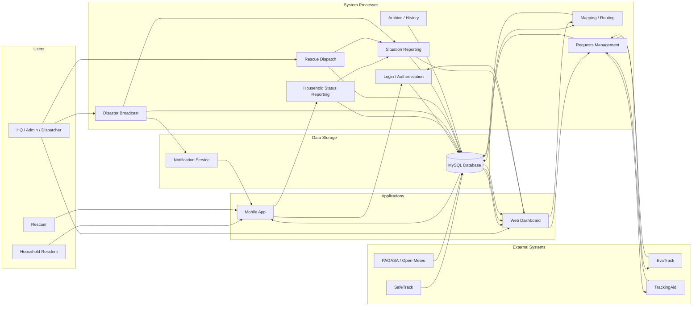

# ResQperation Data Flow Diagram

**Date:** July 1, 2026  
**Scope:** HQ/Admin web system, household mobile app, rescuer mobile app, backend services, database, and external integrations

## Overview

This diagram shows the main flow of data across the ResQperation system from user input to storage, processing, monitoring, and reporting.

## Detailed Data Flow by Module

### 1. Authentication and user access
- User credentials are entered in the web or mobile app.
- The request is sent to the Laravel authentication service.
- The backend validates the account and returns an authenticated session/token.
- The role of the user determines which modules are available.

### 2. Household status reporting flow
- The household resident submits a status update from the mobile app.
- The status is sent to the household status module in the backend.
- The backend validates the data and stores the report in the database.
- The data is then shown in the web dashboard, map view, and household monitoring page.

### 3. Disaster broadcast flow
- HQ/Admin creates a disaster event or alert from the web dashboard.
- The broadcast module stores the event details and target areas.
- The backend sends broadcast data to the mobile app and notification service.
- Household and rescuer users receive the alert and can respond.

### 4. Rescue dispatch flow
- HQ/Admin selects an affected area or purok in the dispatch module.
- The dispatch record is saved in the database.
- The assigned team receives the dispatch through the mobile app.
- Field updates from the responder are sent back to the backend and reflected in the HQ dashboard.

### 5. Mapping and routing flow
- Household, evacuation site, and rescue team locations are read from the database.
- The mapping module generates display layers and route information.
- The web dashboard shows the map and routing data for response planning.

### 6. Request management flow
- Incoming requests are received from external systems such as EvaTrack.
- The request module stores and validates the record.
- HQ/Admin reviews the request and forwards it for tracking or fulfillment.
- Status updates are maintained in the database and visible in the request dashboard.

### 7. Situation reporting flow
- Incident and operational data are collected from household reports, dispatch updates, and broadcasts.
- The situation report module generates a SitRep.
- The SitRep can be saved, exported, archived, and reviewed by HQ/Admin.

### 8. Archive and documentation flow
- Reports, alerts, dispatches, and request records are archived after processing.
- The archive module stores historical records for documentation and future review.
- Archived data can be searched and exported by HQ/Admin.

## Data Stores Involved

- MySQL database for core operational records
- Device and status logs for household reporting
- Broadcast and event logs for alerts
- Dispatch and team activity records
- Request and validation records
- Archive files and SitRep documents

## External Data Exchange Summary

- SafeTrack: household account and resident-related data
- EvaTrack: incoming request data
- TrackingAid: request forwarding and fulfillment tracking
- PAGASA/Open-Meteo: weather and disaster monitoring inputs
