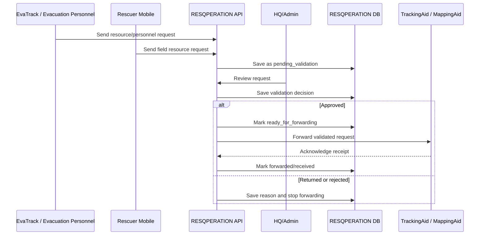

# RESQPERATION External System Integration Draft

This is a draft only. Do not implement database changes until the other groups provide final table names, credentials, and data contracts.

## 1. Integration Scope

RESQPERATION connects with different external systems for different reasons.

| External system/source | Direction | Purpose | Current status |
| --- | --- | --- | --- |
| SafeTrack | SafeTrack -> RESQPERATION | Registered household accounts and household identity | Existing shared DB dependency |
| EvaTrack | EvaTrack -> RESQPERATION | Evacuation personnel/resource/personnel requests | Draft/coordination needed |
| TrackingAid / MappingAid | RESQPERATION -> TrackingAid/MappingAid | Forward validated resource requests after HQ/Admin review | Pending external system details |
| PAGASA | PAGASA -> RESQPERATION | Official warning confirmation links/advisories | Links available, API token pending |
| Open-Meteo | Open-Meteo -> RESQPERATION | Automated weather snapshots for monitoring | Implemented as non-official weather source |
| Expo Push | RESQPERATION -> Mobile apps | Push notification delivery | Pending production setup |

## 2. Important Business Rule

RESQPERATION is the validation pit stop for requests.

Requests from rescuers, EvaTrack, or evacuation personnel should not go directly to TrackingAid/MappingAid. The correct flow is:

1. Request is received by RESQPERATION.
2. HQ/Admin reviews the request.
3. HQ/Admin validates, returns, or rejects the request.
4. Only validated requests are forwarded to TrackingAid/MappingAid.
5. RESQPERATION keeps the validation trail for audit and SitRep reporting.

## 3. SafeTrack Integration

SafeTrack is the source of registered household accounts.

Expected shared data:

- Household ID
- Household head/family name
- Household members
- Registered barangay
- Address/purok/sitio if available
- Login credential fields in the shared `users` table

RESQPERATION should:

- Authenticate household users from shared DB records.
- Avoid creating household accounts manually in RESQPERATION.
- Save disaster status, device, battery, GPS, and household reports under RESQPERATION-owned operational tables.
- Respect SafeTrack as the household identity source.

## 4. EvaTrack Integration

EvaTrack is expected to send requests from evacuation personnel or evacuation operations.

Expected request fields:

| Field | Description |
| --- | --- |
| `external_request_id` | EvaTrack request identifier |
| `source_system` | Example: `evatrack` |
| `request_type` | Resource, personnel, medical, transport, food, water, shelter, etc. |
| `requested_item` | Item/personnel requested |
| `quantity` | Requested amount |
| `unit` | packs, boxes, persons, liters, etc. |
| `priority` | low, normal, high, critical |
| `location_name` | Evacuation center, purok, or site |
| `latitude` / `longitude` | Optional request location |
| `requested_by` | Evacuation personnel or office |
| `contact_number` | Request contact |
| `notes` | Additional request details |
| `requested_at` | Date/time from EvaTrack |

Recommended RESQPERATION handling:

- Save incoming request as `pending_validation`.
- Display it in Resources & Requests.
- Require HQ/Admin decision before forwarding.
- Keep validation remarks and validator account.

## 5. TrackingAid / MappingAid Pending Integration

The exact name and database/API contract are still pending from the other group. Use this neutral label until confirmed:

```text
TrackingAid / MappingAid
```

Expected role:

- Receive validated resource requests from RESQPERATION.
- Handle delivery/tracking outside RESQPERATION scope.
- Return delivery/tracking status later if their group supports it.

RESQPERATION should not handle actual delivery. It only validates and forwards.

## 6. Draft Environment Variables

Do not put real credentials in GitHub.

```env
# Pending external TrackingAid / MappingAid shared DB
TRACKINGAID_DB_CONNECTION=mysql
TRACKINGAID_DB_HOST=to_be_provided
TRACKINGAID_DB_PORT=3306
TRACKINGAID_DB_DATABASE=to_be_provided
TRACKINGAID_DB_USERNAME=to_be_provided
TRACKINGAID_DB_PASSWORD=to_be_provided
TRACKINGAID_DB_TIMEOUT=5

# If they provide API instead of DB
TRACKINGAID_API_BASE_URL=
TRACKINGAID_API_TOKEN=
```

## 7. Draft Forwarding Statuses

| Status | Meaning |
| --- | --- |
| `pending_validation` | Request received by RESQPERATION but not yet reviewed |
| `validated` | HQ/Admin approved the request |
| `returned` | HQ/Admin needs correction or more information |
| `rejected` | HQ/Admin rejected the request |
| `ready_for_forwarding` | Validated and queued for TrackingAid/MappingAid |
| `forwarded` | Sent to TrackingAid/MappingAid |
| `forward_failed` | Sending failed and needs retry |
| `received_by_trackingaid` | TrackingAid/MappingAid acknowledged receipt |

## 8. Draft Integration Flow



## 9. Draft Shared DB Tables For Review Only

If TrackingAid/MappingAid uses a separate shared database, RESQPERATION can either:

- connect directly to their provided DB using a second Laravel DB connection; or
- call their API if they provide one.

Direct DB connection is simpler for a capstone demo but must be coordinated carefully to avoid overwriting another group's data.

Review-only table ideas:

```text
trackingaid_resource_request_outbox
trackingaid_resource_request_forwarding_logs
trackingaid_delivery_status_mirror
```

No migration should be run yet. Wait for:

- database host/IP
- database name
- username/password
- table naming convention
- required columns
- allowed write permissions
- whether they prefer DB sharing or API endpoints

## 10. Final Defense Explanation

Recommended explanation:

> RESQPERATION validates incoming resource and personnel requests first. It does not directly deliver resources. After HQ/Admin approval, validated requests are forwarded to TrackingAid/MappingAid, which handles tracking/delivery. This keeps responsibilities clear between systems and provides an audit trail for SitRep and archive reporting.
