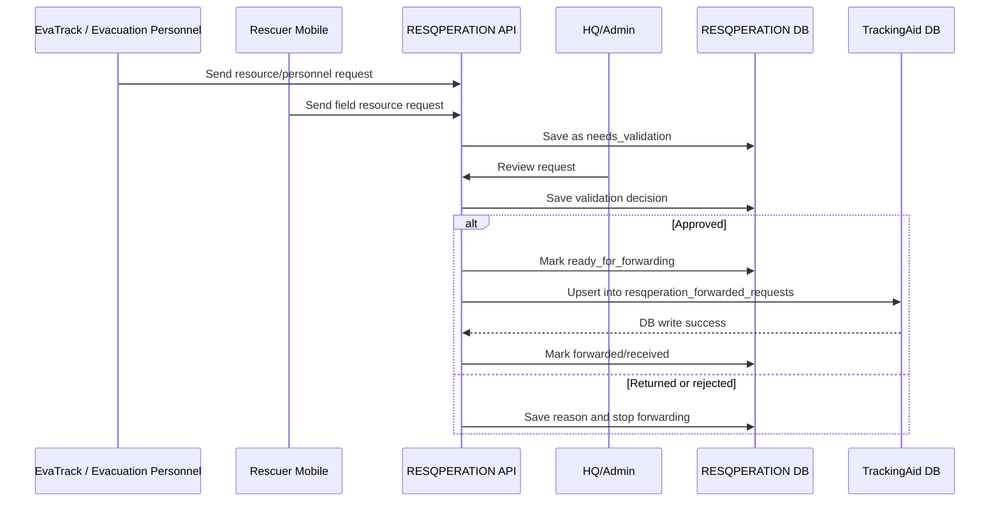

# RESQPERATION External System Integration Draft

This document records the current RESQPERATION external request integration. Keep table names and credentials in `.env`; do not hard-code them.

## 1. Integration Scope

RESQPERATION connects with different external systems for different reasons.

| External system/source | Direction | Purpose | Current status |
| --- | --- | --- | --- |
| SafeTrack | SafeTrack -> RESQPERATION | Registered household accounts and household identity | Existing shared DB dependency |
| EvaTrack | EvaTrack -> RESQPERATION | Evacuation personnel/resource/personnel requests | External intake endpoint added |
| TrackingAid | RESQPERATION -> TrackingAid | Forward validated resource requests after HQ/Admin review | Second DB connection and `resqperation_forwarded_requests` handoff table implemented |
| PAGASA | PAGASA -> RESQPERATION | Official warning confirmation links/advisories | Links available, API token pending |
| Open-Meteo | Open-Meteo -> RESQPERATION | Automated weather snapshots for monitoring | Implemented as non-official weather source |
| OneSignal | RESQPERATION -> Mobile apps | Mobile push notification delivery | Implemented for device registration and Laravel push sending |

## 2. Important Business Rule

RESQPERATION is the validation pit stop for requests.

Requests from rescuers, EvaTrack, or evacuation personnel should not go directly to TrackingAid. The correct flow is:

1. Request is received by RESQPERATION.
2. HQ/Admin reviews the request.
3. HQ/Admin validates, returns, or rejects the request.
4. Only validated requests are forwarded to TrackingAid.
5. RESQPERATION keeps the validation trail for audit, SitRep, and archive reporting.

## 3. SafeTrack Integration

SafeTrack is the source of registered household accounts.

Expected shared data:

- Household ID
- Household head/family name
- Household members
- Registered barangay
- Address/purok/sitio if available
- Login credential fields in the shared `users` table

RESQPERATION should:

- Authenticate household users from shared DB records.
- Avoid creating household accounts manually in RESQPERATION.
- Save disaster status, device, battery, GPS, and household reports under RESQPERATION-owned operational tables.
- Respect SafeTrack as the household identity source.

## 4. EvaTrack Integration

EvaTrack is expected to send requests from evacuation personnel or evacuation operations.

Current intake endpoint:

```text
POST /api/v1/external/resource-requests
```

Required header:

```text
X-RESQPERATION-INTEGRATION-KEY: value-from-EXTERNAL_REQUEST_INTAKE_KEY
```

The endpoint saves or updates records in RESQPERATION `resource_requests`. It does not forward requests automatically. HQ/Admin still needs to validate the request first.

Expected request fields:

| Field | Description |
| --- | --- |
| `external_request_id` | EvaTrack request identifier |
| `source_system` | Example: `evatrack` |
| `request_type` | Resource, personnel, medical, transport, food, water, shelter, etc. |
| `requested_item` | Item/personnel requested |
| `quantity` | Requested amount |
| `unit` | packs, boxes, persons, liters, etc. |
| `priority` | low, normal, high, critical |
| `location_name` | Evacuation center, purok, or site |
| `latitude` / `longitude` | Optional request location |
| `requested_by` | Evacuation personnel or office |
| `contact_number` | Request contact |
| `notes` | Additional request details |
| `requested_at` | Date/time from EvaTrack |

Recommended RESQPERATION handling:

- Save incoming request as `pending_validation`.
- Display it in Resources & Requests.
- Require HQ/Admin decision before forwarding.
- Keep validation remarks and validator account.

Example JSON body:

```json
{
  "external_request_id": "EVAT-20260702-001",
  "source_system": "EvaTrack",
  "request_type": "Resource",
  "requested_item": "Food packs",
  "quantity": 25,
  "unit": "packs",
  "priority": "high",
  "location_name": "Mambaling Evacuation Center",
  "requested_by": "EvaTrack evacuation personnel",
  "contact_number": "09170000000",
  "notes": "For families at the evacuation site",
  "requested_at": "2026-07-02 20:30:00"
}
```

## 5. TrackingAid Request Handoff

TrackingAid uses a separate database connection from RESQPERATION. The Laravel connection name is:

```text
trackingaid
```

Current local environment values are stored in `backend-laravel/.env` using the `TRACKINGAID_DB_*` keys. Do not commit real credentials to GitHub.

Current handoff table:

```text
resqperation_forwarded_requests
```

This table is namespaced for RESQPERATION so it does not overwrite TrackingAid-owned tables. It can be created in either of these ways:

```bash
cd C:\backend\G10CAPSTONE\resqperation-system\backend-laravel
php artisan migrate --database=trackingaid --path=database/migrations/trackingaid
```

or:

```bash
cd C:\backend\G10CAPSTONE\resqperation-system\backend-laravel
php artisan db:seed --class=TrackingAidIntegrationSeeder
```

The forwarding service also checks that the table exists before inserting a handoff record.

Expected TrackingAid role:

- Receive validated resource requests from RESQPERATION.
- Handle delivery/tracking outside RESQPERATION scope.
- Return delivery/tracking status later if their group supports it.

RESQPERATION should not handle actual delivery. It only validates and forwards.

## 6. Draft Environment Variables

Do not put real credentials in GitHub.

```env
TRACKINGAID_DB_CONNECTION=mysql
TRACKINGAID_DB_HOST=127.0.0.1
TRACKINGAID_DB_PORT=3306
TRACKINGAID_DB_DATABASE=trackingaid_db
TRACKINGAID_DB_USERNAME=to_be_provided
TRACKINGAID_DB_PASSWORD=to_be_provided
TRACKINGAID_DB_TIMEOUT=5
TRACKINGAID_FORWARD_TABLE=resqperation_forwarded_requests
EXTERNAL_REQUEST_INTAKE_KEY=change-this-shared-request-key

# If they provide API instead of DB
TRACKINGAID_API_BASE_URL=
TRACKINGAID_API_TOKEN=
```

## 7. Draft Forwarding Statuses

| Status | Meaning |
| --- | --- |
| `needs_validation` | Request received by RESQPERATION but not yet reviewed |
| `validated` | HQ/Admin approved the request |
| `returned` | HQ/Admin needs correction or more information |
| `rejected` | HQ/Admin rejected the request |
| `ready_for_forwarding` | Validated and ready for TrackingAid handoff |
| `forwarded` | Sent to TrackingAid |
| `forward_failed` | Sending failed and needs retry |
| `received_by_trackingaid` | TrackingAid acknowledged receipt if they implement a callback/status update later |

## 8. Draft Integration Flow


```mermaid
sequenceDiagram
  participant Eva as EvaTrack / Evacuation Personnel
  participant Rescuer as Rescuer Mobile
  participant API as RESQPERATION API
  participant Admin as HQ/Admin
  participant DB as RESQPERATION DB
  participant Track as TrackingAid DB

  Eva->>API: Send resource/personnel request
  Rescuer->>API: Send field resource request
  API->>DB: Save as needs_validation
  Admin->>API: Review request
  API->>DB: Save validation decision
  alt Approved
    API->>DB: Mark ready_for_forwarding
    API->>Track: Upsert into resqperation_forwarded_requests
    Track-->>API: DB write success
    API->>DB: Mark forwarded/received
  else Returned or rejected
    API->>DB: Save reason and stop forwarding
  end
```

## 9. TrackingAid Shared DB Table

RESQPERATION writes forwarded requests to:

```text
resqperation_forwarded_requests
```

Important columns:

- `tracking_reference`
- `resqperation_request_id`
- `source_reference`
- `request_source`
- `source_system`
- `request_category`
- `resource_type`
- `item_name`
- `quantity`
- `unit`
- `urgency`
- `area_label`
- `requested_by`
- `validation_notes`
- `validated_by_user_id`
- `forwarded_by_user_id`
- `forwarded_by_name`
- `forwarded_by_role`
- `payload_json`
- `forwarded_at`

If TrackingAid later provides a final required table, update `TRACKINGAID_FORWARD_TABLE` and adjust `TrackingAidForwardingService` mapping only. The current implementation writes to `resqperation_forwarded_requests`.

## 10. Final Defense Explanation

Recommended explanation:

> RESQPERATION validates incoming resource and personnel requests first. It does not directly deliver resources. After HQ/Admin approval, validated requests are forwarded to TrackingAid through a second database handoff table. TrackingAid handles tracking/delivery. This keeps responsibilities clear between systems and provides an audit trail for SitRep and archive reporting.
