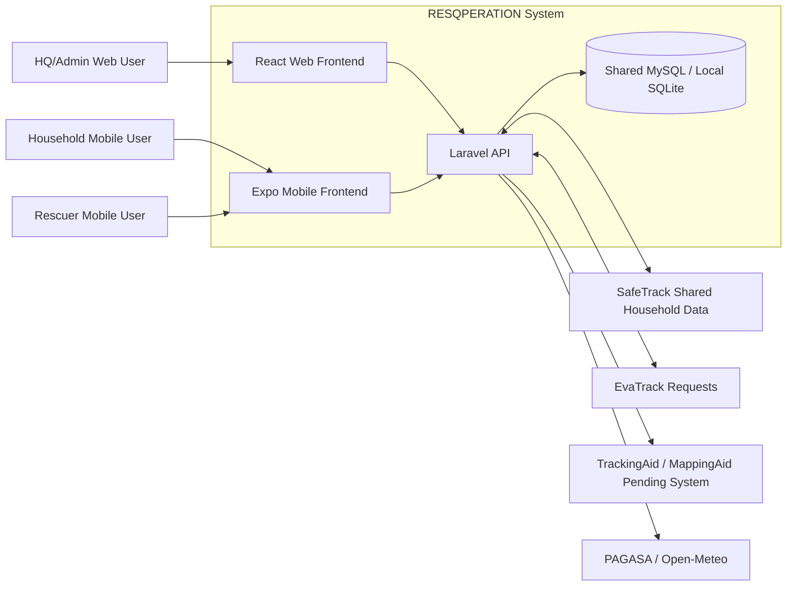
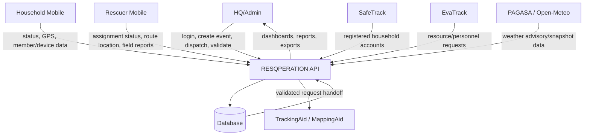
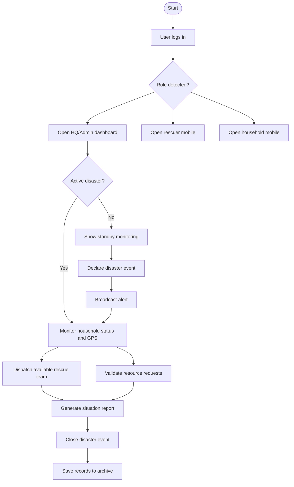
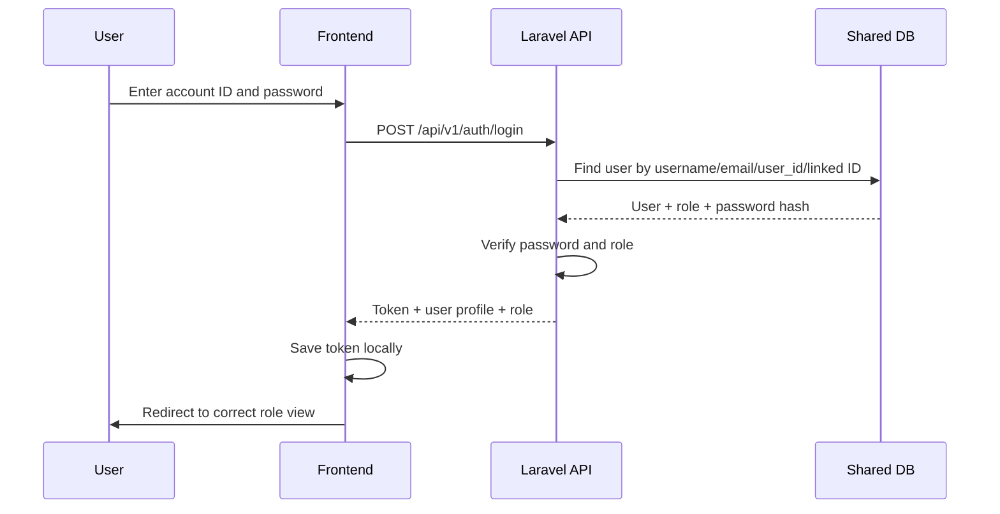
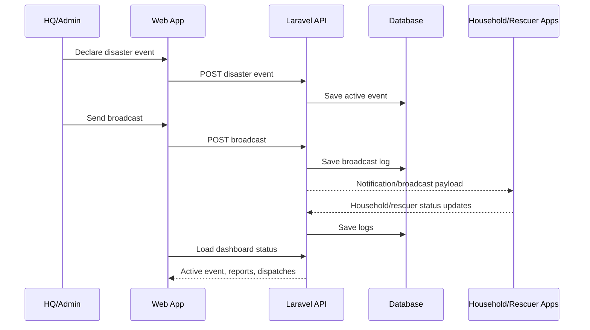
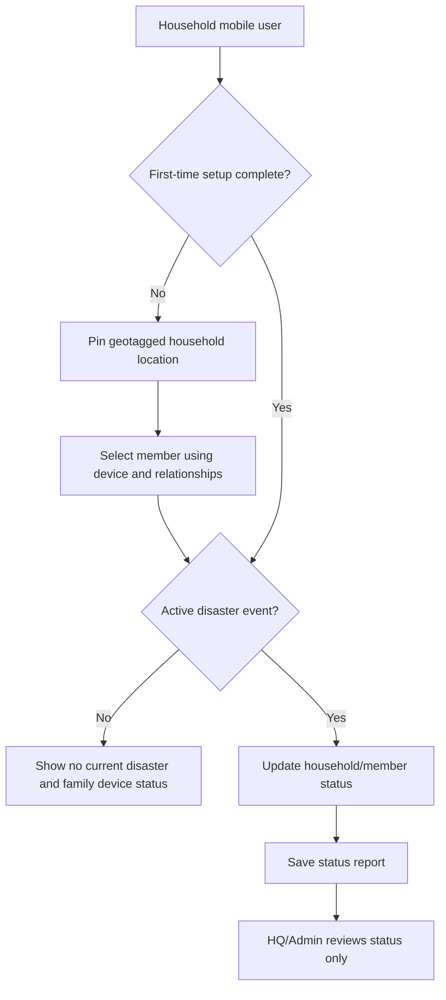
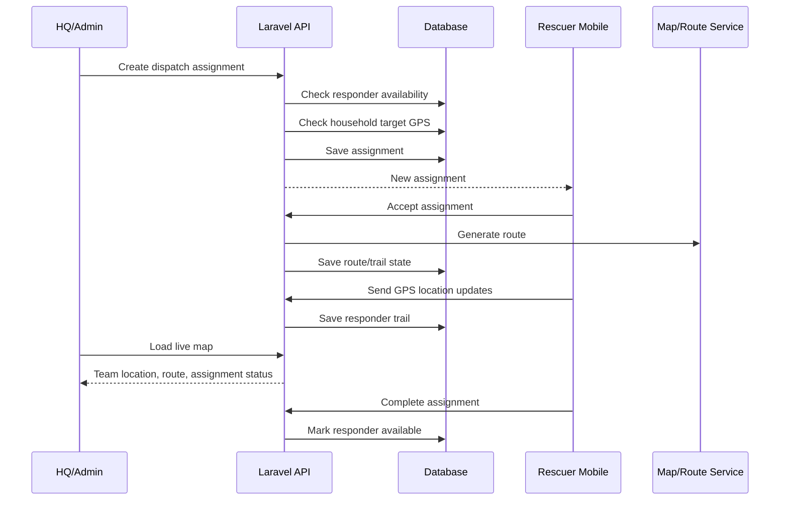
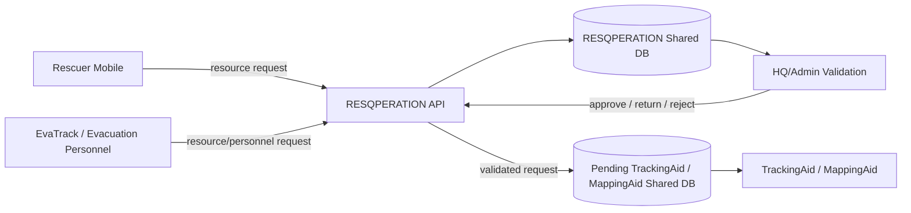
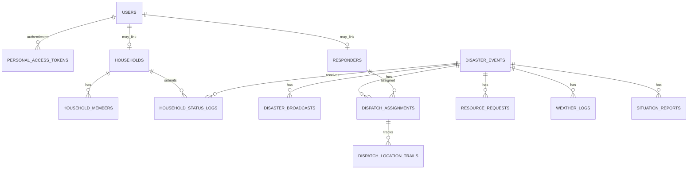
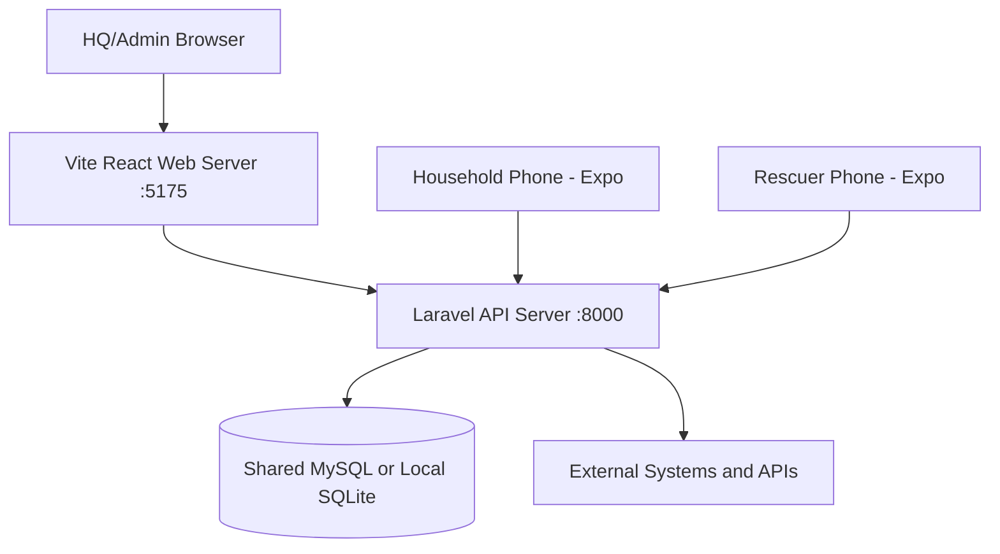

# RESQPERATION Final Defense Study Guide and Diagrams

Use this document to prepare for technical defense. It explains what the team must understand from the system concept down to the code.

## 1. System Concept To Study

RESQPERATION is a barangay disaster response management system. The system helps HQ/Admin users declare disaster events, broadcast alerts, monitor household safety status, dispatch rescue teams, validate resource requests, review weather information, generate situation reports, and archive disaster records.

The system is not the creator of all data. It acts as a response operations hub that reads, validates, and forwards data from multiple sources:

- SafeTrack provides registered household identity/account data.
- EvaTrack can send evacuation/personnel/resource requests.
- RESQPERATION validates and monitors requests.
- TrackingAid / MappingAid will receive validated resource requests after their system is ready.
- PAGASA is the official warning confirmation source.
- Open-Meteo is used for automated weather snapshots while waiting for official PAGASA API access.

## 2. Coding Topics The Team Must Learn

### Laravel Backend

- How API routes are defined in `backend-laravel/routes/api.php`.
- How controllers stay thin and call service classes.
- How request validation works before saving data.
- How Laravel Sanctum tokens authenticate web and mobile users.
- How role middleware separates HQ/Admin, rescuer, and household access.
- How the backend reads from shared database tables.
- How local SQLite mode differs from shared MySQL mode.
- How to avoid running destructive migrations on the shared DB.
- How services such as `WeatherSnapshotService`, `MappingService`, `RescueDispatchService`, and `ArchiveService` work.

### React Web Frontend

- How Vite starts the web app.
- How `App.jsx` defines routes and protects HQ/Admin pages.
- How `api/client.js` adds the API base URL, auth token, and timeout.
- How pages fetch data using `useEffect`.
- How loading, error, and empty states are shown.
- How reusable components are split by feature.
- How export-to-PDF and export-to-Excel are generated in the browser.
- How map data is rendered using Leaflet / React Leaflet.

### Expo Mobile Frontend

- How household and rescuer users log in through the same Laravel API.
- How household first-time setup saves geotagged location.
- How household members and device data are synced.
- How rescuers receive assignments and send location/status updates.
- How the rescuer radio/PTT screen works now, and why real live audio needs a WebRTC server later.
- How mobile apps should use the laptop/network API URL during development.

### Database

- How shared tables represent users, households, responders, disaster events, status logs, dispatches, resource requests, weather logs, and reports.
- Why SQL proposals are placed under `docs/sql_proposals/` before DB member approval.
- Why the system must not run `migrate:fresh` on shared MySQL.
- How local SQLite is only for offline UI/backend testing.

### Security

- Passwords must be hashed in the database.
- Login uses tokens, not plain session-only access.
- Role checks must happen in the backend, not only in the frontend.
- Household GPS and phone data are personal/sensitive data.
- Only necessary data should be shown per role.
- Exports must not expose private records to unauthorized roles.
- The team should explain how RA 10173/Data Privacy Act affects GPS, household, and contact information.

## 3. Legal and Reference Frameworks

Use these as defense references. Verify exact citations with the adviser before final manuscript submission.

- Republic Act No. 10121 - Philippine Disaster Risk Reduction and Management Act of 2010.
- Republic Act No. 10173 - Data Privacy Act of 2012.
- Barangay DRRM / BDRRMC operational practices.
- PAGASA weather advisories and warning products.
- Open-Meteo API documentation for non-official automated weather snapshots.

Official/reference links:

- RA 10121 Senate library: https://issuances-library.senate.gov.ph/legislative%2Bissuances/Republic%20Act%20No.%2010121
- RA 10121 Lawphil: https://lawphil.net/statutes/repacts/ra2010/ra_10121_2010.html
- RA 10173 National Privacy Commission: https://privacy.gov.ph/data-privacy-act/
- PAGASA weather advisory page: https://www.pagasa.dost.gov.ph/weather/weather-advisory
- PAGASA weather page: https://www.pagasa.dost.gov.ph/weather
- Open-Meteo docs: https://open-meteo.com/en/docs

## 4. Use Case Diagram

```mermaid
usecaseDiagram
actor "HQ/Admin" as Admin
actor "Household Resident" as Household
actor "Rescuer" as Rescuer
actor "Evacuation Personnel" as EvacPersonnel
actor "SafeTrack" as SafeTrack
actor "EvaTrack" as EvaTrack
actor "TrackingAid / MappingAid" as TrackingAid
actor "PAGASA / Open-Meteo" as WeatherSource

Admin --> (Log in to web dashboard)
Admin --> (Declare disaster event)
Admin --> (Broadcast disaster alert)
Admin --> (Monitor household status)
Admin --> (Dispatch rescue team)
Admin --> (Validate resource request)
Admin --> (Forward validated request)
Admin --> (Generate SitRep)
Admin --> (Archive event records)
Admin --> (Manage rescuer accounts)

Household --> (Log in to mobile app)
Household --> (Complete first-time geotag setup)
Household --> (Update household/member status)
Household --> (View QR for evacuation update)
Household --> (Manage trusted household)

Rescuer --> (Log in to mobile app)
Rescuer --> (Accept dispatch assignment)
Rescuer --> (Send GPS/location trail)
Rescuer --> (Submit field report)
Rescuer --> (Request resources)

EvacPersonnel --> (Request resources through EvaTrack)
SafeTrack --> (Provide registered household accounts)
EvaTrack --> (Send evacuation/resource requests)
TrackingAid --> (Receive validated resource requests)
WeatherSource --> (Provide weather source data)
```

## 5. System Context Diagram



## 6. Data Flow Diagram - Level 0



## 7. Main System Flow



## 8. Authentication Flow



## 9. Disaster Broadcasting Flow



## 10. Household Status Flow



## 11. Rescue Dispatch Flow



## 12. Resource Request Integration Flow



## 13. Data Model Overview



## 14. Deployment Diagram



## 15. Defense Questions To Prepare For

- Why did you use Laravel for the backend instead of plain HTML or direct database access?
- How does the system prevent HQ/Admin from manually changing household safety status?
- How does role-based access work?
- How does the system know if a user is HQ/Admin, rescuer, or household resident?
- What happens if the shared database is offline?
- Why is GPS sensitive data?
- How do you prevent a rescuer from receiving multiple dispatches at the same time?
- How does the map know which household or responder to display?
- How are weather snapshots saved and why is PAGASA still the official confirmation source?
- What data is exported to PDF/Excel and who is allowed to export it?
- Which modules are already working and which integrations are still pending?
- How will RESQPERATION connect to TrackingAid / MappingAid when their system is ready?

## 16. Current Pending Work

- Push notification sending and receiving.
- Real rescuer radio/PTT audio streaming through LiveKit/WebRTC.
- Final external integration with TrackingAid / MappingAid once they provide database/API details.
- Final official PAGASA API integration if token/access is approved.
- Final deployment configuration.
- Final security review and adviser-approved legal citations.
