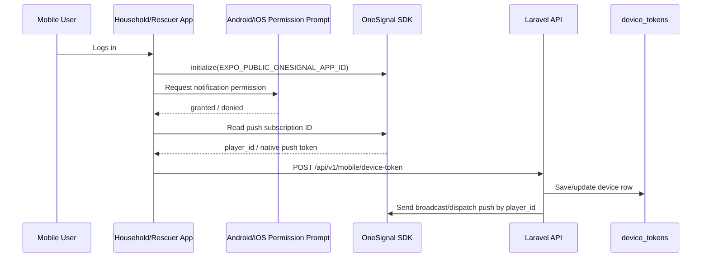

# RESQPERATION OneSignal Mobile Setup

Use this guide for household and rescuer mobile notifications through
OneSignal Player ID / push subscription ID.

## What Was Added In Frontend Mobile

- `react-native-onesignal`
- `onesignal-expo-plugin`
- `EXPO_PUBLIC_ONESIGNAL_APP_ID`
- OneSignal initialization in `frontend-mobile/utils/pushNotifications.ts`
- OneSignal permission prompt through the native system permission dialog
- OneSignal `player_id` / push subscription ID collection
- OneSignal fields included in the existing `/mobile/device-token` request

## Required OneSignal Dashboard Setup

1. Create or open the RESQPERATION app in OneSignal.
2. Copy the OneSignal App ID.
3. Put it in `frontend-mobile/.env` and `frontend-mobile/app.json` `extra.oneSignalAppId`:

```env
EXPO_PUBLIC_ONESIGNAL_APP_ID=YOUR-ONESIGNAL-APP-ID
```

4. Configure Android in OneSignal with Firebase/FCM credentials.
5. Configure iOS later with APNs credentials when an Apple Developer account is
   available.

## Authentication Rule

The mobile app authenticates to the OneSignal SDK using only the public
OneSignal App ID.

Do not put the OneSignal REST API key in `frontend-mobile`.

The REST API key is server-side only. Laravel uses it through
`OneSignalNotificationService` when the backend sends broadcasts or dispatch
assignments to OneSignal. Putting the REST API key in the mobile app would
expose it to anyone who extracts the app.

For server-side REST requests, OneSignal uses this header format:

```http
Authorization: Key YOUR_ONESIGNAL_API_KEY
```

That key belongs in Laravel `.env`, not in `frontend-mobile/.env`.

```env
ONESIGNAL_APP_ID=YOUR-ONESIGNAL-APP-ID
ONESIGNAL_API_KEY=YOUR-ONESIGNAL-REST-API-KEY
```

## Development Build Required

OneSignal is a native SDK. Expo Go can run the mobile app by QR code for normal
screen/API testing, but Expo Go cannot generate a real OneSignal Player ID.

If only the location permission appears after login, the app is most likely
running in Expo Go or in an old build made before OneSignal was added. Install a
fresh RESQPERATION development build, then open that installed app instead of
Expo Go.

For normal phone QR testing:

```bash
cd frontend-mobile
npm start
```

Scan the QR code with Expo Go.

For real OneSignal push-token testing, install a development build on the actual
phone once, then start Metro in dev-client mode:

```bash
cd frontend-mobile
npm run build:dev:android
npm run start:dev
```

Open the QR with the installed RESQPERATION development app. No emulator is
required.

If EAS reports that build credits are already used, a new cloud APK will not be
created. Use one of these instead:

1. Install the latest finished Android development APK from EAS:

```text
https://expo.dev/artifacts/eas/22yUVpAXJ9QmuOdlZNS5sPJuqfSqk2QgsYr9tu4FX80.apk
```

After installing the APK on the physical phone, run:

```bash
npm run start:dev
```

If the installed app says `failed to connect to /192.168... port 8082`, the
phone cannot reach the laptop Metro server through LAN. Start Metro through a
tunnel instead:

```bash
npm run start:dev:tunnel
```

Use the QR or URL shown by the tunnel command inside the installed development
app. Tunnel mode is slower but avoids Wi-Fi isolation and Windows Firewall
blocking.

Do not use `expo run:android` for OneSignal testing in this project workflow.
That command can open an emulator/device selector. Use the installed APK and
`npm run start:dev` only.

The `npm run start:dev` QR is not an Expo Go QR. It is a development-client
deep link. If the normal phone camera says the QR has no usable data, open the
installed RESQPERATION development app and manually enter the Metro URL printed
after `url=`. For example, if the terminal prints:

```text
exp+frontend-mobile://expo-development-client/?url=http%3A%2F%2F192.168.112.130%3A8082
```

enter this URL inside the installed development app:

```text
http://192.168.112.130:8082
```

If Metro is stale or the app does not refresh, restart with:

```bash
npm run start:dev:clear
```

OneSignal subscriptions appear in the dashboard only after the installed app
opens, the mobile user logs in, and the Android/iOS notification permission is
accepted.

## How The Mobile Flow Works



The permission prompt and device-token save are triggered immediately after a
successful mobile login for both household and rescuer accounts. The
authenticated role screens also retry registration when opened.

## Payload Sent By The Mobile App

The frontend now sends:

```json
{
  "device_uuid": "rescuer-...",
  "device_name": "Rescuer mobile",
  "platform": "android",
  "player_id": "onesignal-subscription-id",
  "push_token": "native-provider-token",
  "push_provider": "onesignal",
  "one_signal_user_id": "onesignal-user-id",
  "battery_level": 88,
  "notification_permission_status": "granted"
}
```

## Backend Storage Rule

Laravel stores OneSignal notification data in `device_tokens.player_id`,
`device_tokens.push_token`, `device_tokens.one_signal_user_id`,
`device_tokens.push_provider`, and
`device_tokens.notification_permission_status`.

RESQPERATION does not write Expo push tokens. If the shared DB still has an old
`device_tokens.expo_push_token` column, it is ignored by the current mobile
notification flow.

Backend sender files:

- `backend-laravel/app/Services/OneSignalNotificationService.php`
- `backend-laravel/app/Services/DisasterBroadcastService.php`
- `backend-laravel/app/Services/RescueDispatchService.php`

## MySQL Verification Query

Use this after logging in on the mobile app:

```sql
SELECT
    device_uuid,
    user_id,
    household_id,
    member_id,
    platform,
    app_role,
    push_provider,
    player_id,
    push_token,
    one_signal_user_id,
    notification_permission_status,
    last_seen_at,
    is_active
FROM device_tokens
ORDER BY last_seen_at DESC;
```

## References

- OneSignal Expo SDK setup: https://documentation.onesignal.com/docs/en/react-native-expo-sdk-setup
- OneSignal React Native SDK: https://github.com/OneSignal/react-native-onesignal
- OneSignal Expo plugin: https://github.com/OneSignal/onesignal-expo-plugin
