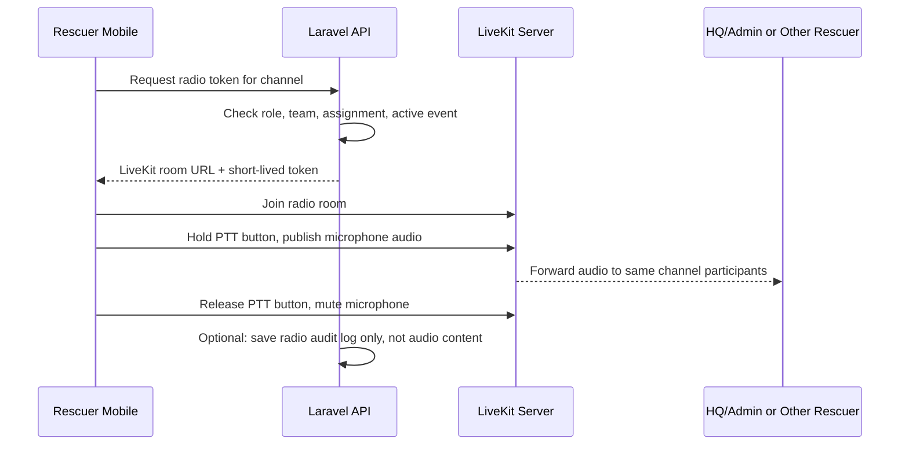

# RESQPERATION Rescuer Radio / Push-To-Talk Plan

This document explains the planned radio-like communication feature for the rescuer mobile app.

## 1. What This Feature Is

The communication style is called Push-To-Talk or PTT.

PTT works like a walkie-talkie:

1. The rescuer joins a channel.
2. The rescuer holds a talk button.
3. The app opens the microphone while the button is held.
4. The rescuer releases the button.
5. The app stops sending audio.
6. Other users in the same channel hear the transmission.

For disaster response, the useful channels are:

- HQ Command channel
- Team channel
- Active disaster event channel
- Assignment/direct channel

## 2. Current Safe Implementation

The current mobile implementation adds a Radio Communication screen in the rescuer app.

Current behavior:

- Opens from the small radio icon in the rescuer header.
- Lets the rescuer switch between command/team/event channels.
- Has a large hold-to-talk button.
- Shows quick signal buttons such as Copy, Need backup, On-scene, and Clear.
- Records a local recent radio log on the screen.

This is UI-ready only. It does not stream live audio yet because real-time audio requires a media server and native WebRTC support.

Reason for this temporary approach:

- It does not damage the current Expo Go workflow.
- It does not add unstable native dependencies.
- It gives the defense panel a clear visible feature while the final audio server is not configured yet.

## 3. Recommended Production Tool

Use LiveKit self-hosted for the final PTT implementation.

Why LiveKit:

- Open source.
- Supports real-time audio through WebRTC.
- Has React Native and Expo documentation.
- Can be self-hosted to avoid paid vendor lock-in.
- Can use Laravel to generate secure room tokens.
- Fits channel-based radio rooms.

Important limitation:

- LiveKit does not run in normal Expo Go because it needs native WebRTC packages.
- The mobile app must use Expo development builds through `expo-dev-client` before adding LiveKit.

## 4. Other Open Source Options

### Mumble / Murmur

Mumble is a free and open-source low-latency voice chat system. Murmur is the server.

Good for:

- Proven low-latency voice channels.
- Self-hosted voice server.
- Privacy-focused communication.

Concern:

- React Native/Expo integration is not as direct as LiveKit.
- It is better as an external voice app or separate server integration, not the easiest embedded mobile feature.

### react-native-webrtc

This is the lower-level WebRTC package for React Native.

Good for:

- Full custom control.
- Free/open-source real-time audio foundation.

Concern:

- More complex than LiveKit.
- Requires custom signaling, room management, and native build setup.
- Not available in Expo Go by default.

### expo-audio

Expo Audio can record and play audio inside Expo Go.

Good for:

- Voice memo / recorded audio clip feature.
- Safer beginner implementation.
- Works without a full WebRTC server.

Concern:

- This is not real-time walkie-talkie communication.
- It is better for asynchronous voice notes, not live radio.

## 5. Recommended Architecture



## 6. Suggested Backend Endpoints Later

Do not add these until LiveKit/voice server is selected.

```text
GET  /api/v1/rescuer/radio/channels
POST /api/v1/rescuer/radio/token
POST /api/v1/rescuer/radio/logs
```

The backend should return only channels the rescuer is allowed to join:

- Own team channel
- Active assignment channel
- Active disaster event channel
- HQ command channel if allowed

## 7. Security and Privacy Rules

- Do not store voice audio unless the client and adviser approve it.
- Store audit metadata only when possible:
  - channel
  - sender
  - start time
  - duration
  - assignment/event ID
- Require authentication before joining a radio room.
- Generate short-lived room tokens from Laravel.
- Do not hardcode LiveKit keys in the mobile app.
- Do not let household users access rescuer radio channels.

## 8. AI Prompt For Future LiveKit Implementation

Use this prompt only after the team is ready to move from Expo Go to Expo development builds:

```text
Implement real push-to-talk radio communication for the RESQPERATION rescuer mobile app.

Stack:
- Expo React Native with expo-dev-client, not Expo Go
- LiveKit self-hosted or LiveKit-compatible server
- Laravel API generates short-lived LiveKit room tokens

Requirements:
- Add /api/v1/rescuer/radio/channels to list allowed channels.
- Add /api/v1/rescuer/radio/token to return a room token for the selected channel.
- Do not hardcode LiveKit server secrets in React Native.
- In the rescuer mobile Radio screen, connect to the selected LiveKit room.
- The large Hold to Talk button should unmute the microphone only while pressed.
- Releasing the button should mute the microphone immediately.
- Show the active channel, connection state, speaking state, and recent metadata log.
- Save only metadata logs unless official approval allows audio storage.
- Keep the code beginner-friendly and split LiveKit logic into a small helper file.
```

## 9. References

- Expo Audio documentation: https://docs.expo.dev/versions/latest/sdk/audio/
- LiveKit Expo documentation: https://docs.livekit.io/transport/sdk-platforms/expo/
- LiveKit React Native documentation: https://docs.livekit.io/transport/sdk-platforms/react-native/
- Mumble official website: https://www.mumble.info/
- react-native-webrtc GitHub: https://github.com/react-native-webrtc/react-native-webrtc
