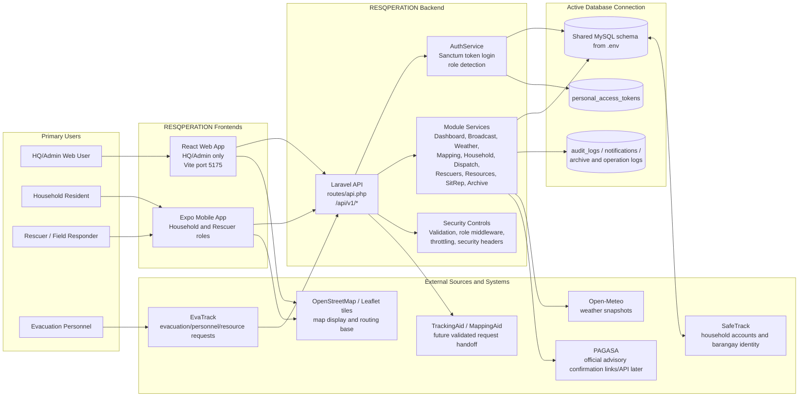
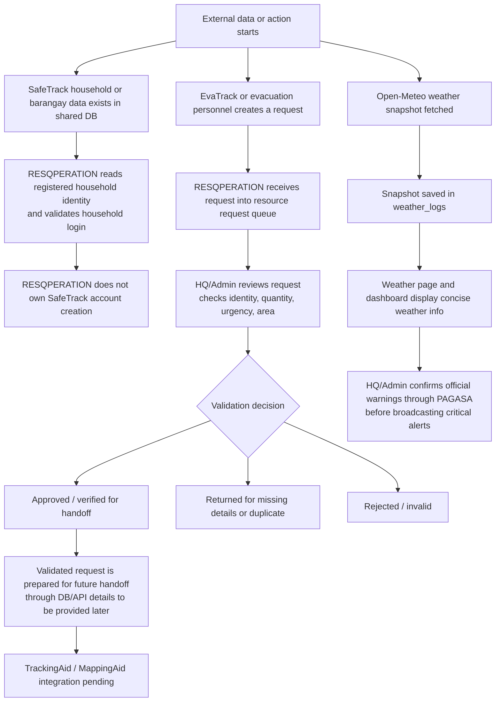
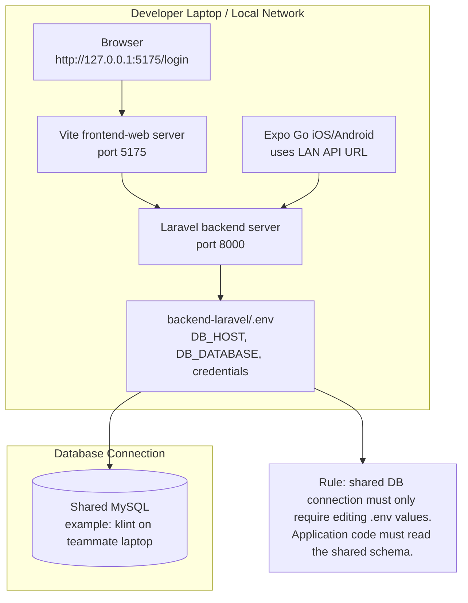

# 01 - System Context and External Integrations

## 1.1 Overall System Context

This diagram shows RESQPERATION as the barangay response operations hub. The system receives and displays data from the active database connection, reads household identity from SafeTrack-related records, receives or validates requests from EvaTrack/rescuer sources, and prepares handoff records for TrackingAid/MappingAid when their integration is ready.

## 1.2 External Integration Responsibilities

## 1.3 Development and Runtime Deployment View

## 1.4 Integration Status Summary

| Integration | Current Purpose | Ownership | Current Status |
| --- | --- | --- | --- |
| SafeTrack | Household and barangay identity source | External/shared DB | RESQPERATION reads available data |
| EvaTrack | Source of evacuation/resource requests | External system | Draft/partial request intake supported |
| TrackingAid / MappingAid | Future destination for validated requests | External system | Pending final DB/API details |
| Open-Meteo | Automated weather snapshots | Public API | Implemented as non-official weather source |
| PAGASA | Official warning confirmation | Government source | Links available; API token pending |
| Map tiles/routing | Visual map, route context | Public map resources / DB routes | Used by web/mobile mapping features |
