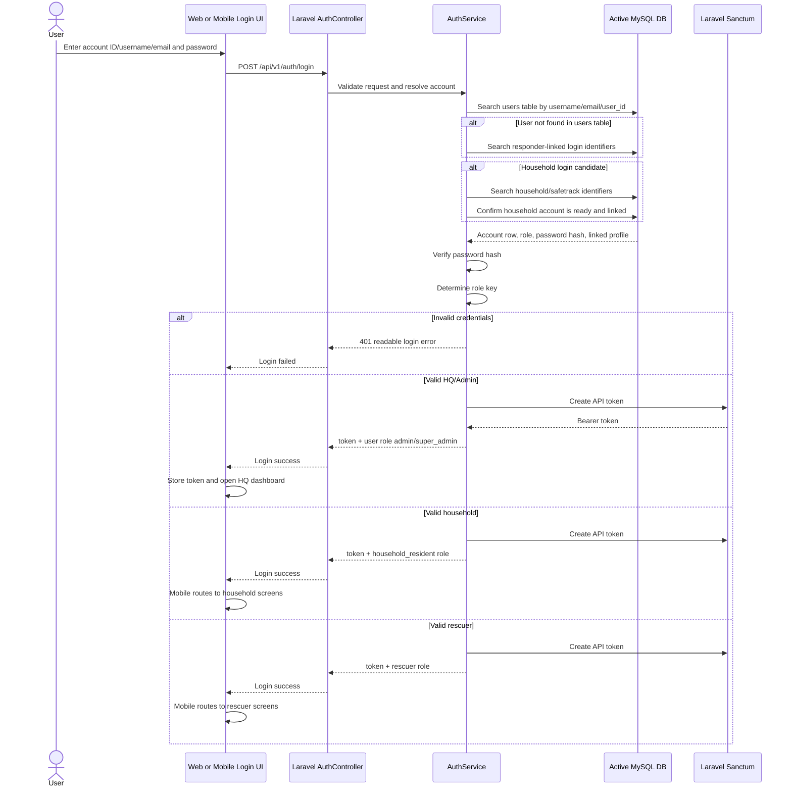
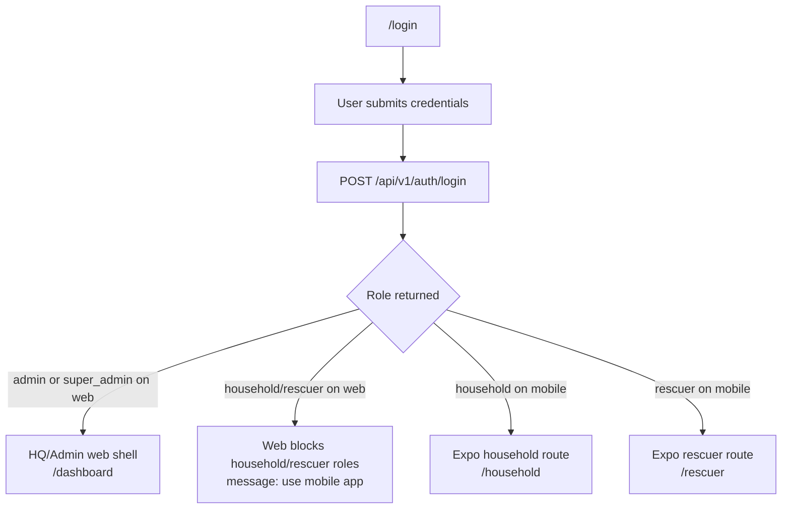

# 02 - Roles, Use Cases, and Authentication

## 2.1 Detailed Role-Based Use Cases

```mermaid
flowchart LR
  subgraph Admin["HQ/Admin Web User"]
    A1["Log in to web"]
    A2["View command dashboard"]
    A3["Declare disaster event"]
    A4["Send disaster broadcast"]
    A5["Refresh and review weather"]
    A6["View barangay map and GPS layers"]
    A7["Monitor household status"]
    A8["Open household history"]
    A9["Create dispatch assignment"]
    A10["Track responder route/location"]
    A11["Create and manage rescuer accounts"]
    A12["Configure rescue teams"]
    A13["Validate resource requests"]
    A14["Forward valid requests"]
    A15["Return invalid or incomplete requests"]
    A16["Generate situation report"]
    A17["Archive and export records"]
    A18["Review notifications"]
    A19["Edit own profile/password"]
  end

  subgraph Household["Household Mobile User"]
    H1["Log in to mobile"]
    H2["Complete first-time geotag setup"]
    H3["Pin address on map"]
    H4["Select family member using device"]
    H5["Update family member profile/relationship"]
    H6["View no-current-disaster home"]
    H7["Update household/member disaster status"]
    H8["View status history"]
    H9["View evacuation QR"]
    H10["Manage trusted household with PIN"]
    H11["Update device location"]
    H12["Log out from profile"]
  end

  subgraph Rescuer["Rescuer Mobile User"]
    R1["Log in to mobile"]
    R2["View field console"]
    R3["Accept assignment"]
    R4["Mark en route"]
    R5["Send location trail"]
    R6["Complete assignment"]
    R7["Submit field report"]
    R8["Create resource request"]
    R9["View map/route"]
    R10["Use team radio/PTT clips"]
    R11["Edit responder profile"]
  end

  subgraph External["External Actors"]
    S1["SafeTrack provides household accounts"]
    E1["EvaTrack sends requests"]
    T1["TrackingAid/MappingAid receives validated handoff later"]
    W1["Weather source provides snapshot/advisory"]
  end

  Admin --- Household
  Admin --- Rescuer
  Admin --- External
```

## 2.2 Authentication and Role Routing Sequence

## 2.3 Permission Boundary Diagram

```mermaid
flowchart TD
  Login["Authenticated request with Sanctum token"]
  RoleCheck{"Role middleware"}

  AdminOnly["super_admin/admin only"]
  SharedStatus["household_resident/rescuer\nstatus log submit"]
  HouseholdOnly["household_resident only"]
  AdminRescuer["admin/super_admin/rescuer\nshared dispatch update"]
  RescuerOnly["rescuer only"]

  Login --> RoleCheck
  RoleCheck --> AdminOnly
  RoleCheck --> SharedStatus
  RoleCheck --> HouseholdOnly
  RoleCheck --> AdminRescuer
  RoleCheck --> RescuerOnly

  AdminOnly --> D1["Dashboard"]
  AdminOnly --> D2["Notifications/Profile"]
  AdminOnly --> D3["Disaster events/broadcasts"]
  AdminOnly --> D4["Weather workspace"]
  AdminOnly --> D5["Map overview"]
  AdminOnly --> D6["Household status review"]
  AdminOnly --> D7["Rescuer accounts and team config"]
  AdminOnly --> D8["Resource requests"]
  AdminOnly --> D9["Situation reports"]
  AdminOnly --> D10["Archive/export/delete saved groups"]
  AdminOnly --> D11["Dispatch creation/completion"]

  SharedStatus --> S1["Household status log creation"]

  HouseholdOnly --> H1["Household overview"]
  HouseholdOnly --> H2["First-time setup"]
  HouseholdOnly --> H3["Device location"]
  HouseholdOnly --> H4["Member edit/status"]
  HouseholdOnly --> H5["Household QR"]
  HouseholdOnly --> H6["Trusted households"]

  AdminRescuer --> AR1["Dispatch status patch"]

  RescuerOnly --> R1["Rescuer profile"]
  RescuerOnly --> R2["Assignments"]
  RescuerOnly --> R3["Assignment GPS"]
  RescuerOnly --> R4["Field reports"]
  RescuerOnly --> R5["Resource requests"]
  RescuerOnly --> R6["Radio communication"]
```

## 2.4 Frontend Role Routing

