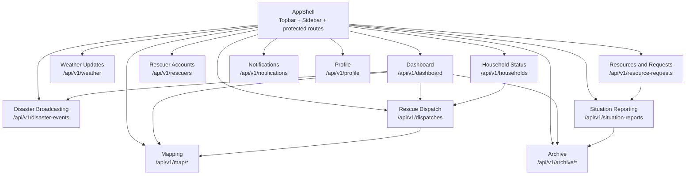
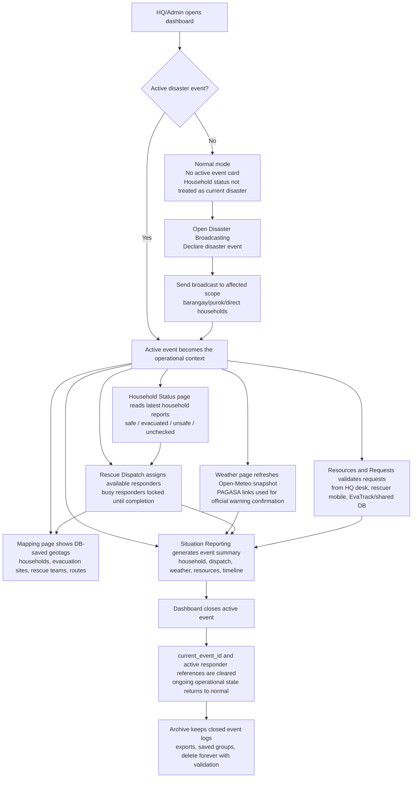
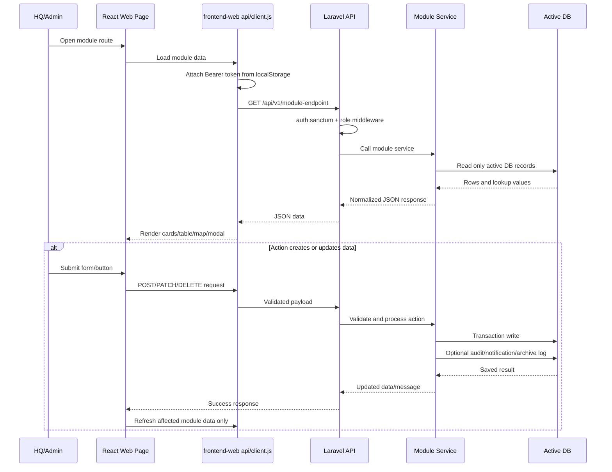
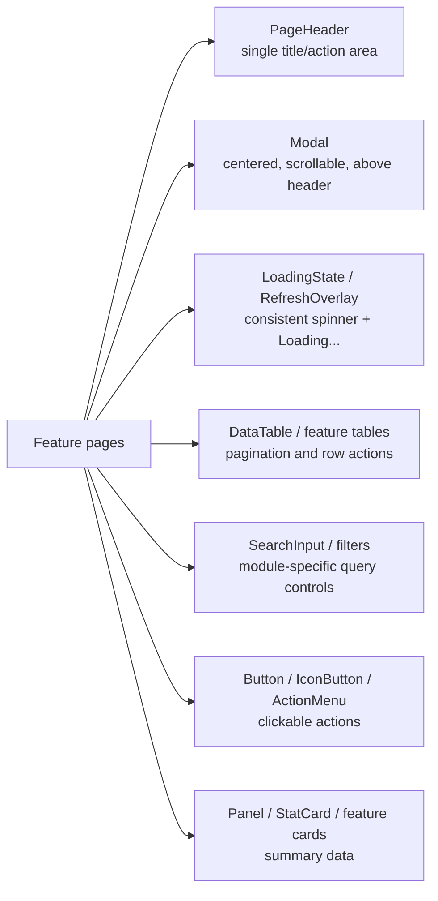

# 03 - HQ/Admin Web Workflows

## 3.1 HQ/Admin Web Module Map

```mermaid
flowchart TD
  Shell["AppShell\nTopbar + Sidebar + protected routes"]
  Dashboard["Dashboard\n/api/v1/dashboard"]
  Broadcast["Disaster Broadcasting\n/api/v1/disaster-events"]
  Weather["Weather Updates\n/api/v1/weather"]
  Mapping["Mapping\n/api/v1/map/*"]
  Households["Household Status\n/api/v1/households"]
  Dispatch["Rescue Dispatch\n/api/v1/dispatches"]
  Rescuers["Rescuer Accounts\n/api/v1/rescuers"]
  Resources["Resources and Requests\n/api/v1/resource-requests"]
  Situation["Situation Reporting\n/api/v1/situation-reports"]
  Archive["Archive\n/api/v1/archive/*"]
  Notifications["Notifications\n/api/v1/notifications"]
  Profile["Profile\n/api/v1/profile"]

  Shell --> Dashboard
  Shell --> Broadcast
  Shell --> Weather
  Shell --> Mapping
  Shell --> Households
  Shell --> Dispatch
  Shell --> Rescuers
  Shell --> Resources
  Shell --> Situation
  Shell --> Archive
  Shell --> Notifications
  Shell --> Profile

  Dashboard --> Broadcast
  Dashboard --> Dispatch
  Dashboard --> Mapping
  Dashboard --> Archive
  Households --> Dispatch
  Dispatch --> Mapping
  Resources --> Situation
  Situation --> Archive
```

## 3.2 HQ/Admin Command Workflow

```mermaid
flowchart TD
  Start["HQ/Admin opens dashboard"]
  ActiveCheck{"Active disaster event?"}
  NoEvent["Normal mode\nNo active event card\nHousehold status not treated as current disaster"]
  Declare["Open Disaster Broadcasting\nDeclare disaster event"]
  Broadcast["Send broadcast to affected scope\nbarangay/purok/direct households"]
  EventActive["Active event becomes the operational context"]

  Weather["Weather page refreshes Open-Meteo snapshot\nPAGASA links used for official warning confirmation"]
  HouseholdStatus["Household Status page reads latest household reports\nsafe / evacuated / unsafe / unchecked"]
  Mapping["Mapping page shows DB-saved geotags\nhouseholds, evacuation sites, rescue teams, routes"]
  Dispatch["Rescue Dispatch assigns available responders\nbusy responders locked until completion"]
  Resources["Resources and Requests validates requests\nfrom HQ desk, rescuer mobile, EvaTrack/shared DB"]
  SitRep["Situation Reporting generates event summary\nhousehold, dispatch, weather, resources, timeline"]
  Close["Dashboard closes active event"]
  Reset["current_event_id and active responder references are cleared\nongoing operational state returns to normal"]
  Archive["Archive keeps closed event logs\nexports, saved groups, delete forever with validation"]

  Start --> ActiveCheck
  ActiveCheck -- No --> NoEvent --> Declare
  ActiveCheck -- Yes --> EventActive
  Declare --> Broadcast --> EventActive
  EventActive --> Weather
  EventActive --> HouseholdStatus
  EventActive --> Mapping
  EventActive --> Dispatch
  EventActive --> Resources
  EventActive --> SitRep
  Weather --> SitRep
  HouseholdStatus --> Dispatch
  Dispatch --> Mapping
  Dispatch --> SitRep
  Resources --> SitRep
  SitRep --> Close --> Reset --> Archive
```

## 3.3 Web Page API Flow

```mermaid
sequenceDiagram
  participant Admin as HQ/Admin
  participant Web as React Web Page
  participant Client as frontend-web api/client.js
  participant API as Laravel API
  participant Service as Module Service
  participant DB as Active DB

  Admin->>Web: Open module route
  Web->>Client: Load module data
  Client->>Client: Attach Bearer token from localStorage
  Client->>API: GET /api/v1/module-endpoint
  API->>API: auth:sanctum + role middleware
  API->>Service: Call module service
  Service->>DB: Read only active DB records
  DB-->>Service: Rows and lookup values
  Service-->>API: Normalized JSON response
  API-->>Client: JSON data
  Client-->>Web: Render cards/table/map/modal

  alt Action creates or updates data
    Admin->>Web: Submit form/button
    Web->>Client: POST/PATCH/DELETE request
    Client->>API: Validated payload
    API->>Service: Validate and process action
    Service->>DB: Transaction write
    Service->>DB: Optional audit/notification/archive log
    DB-->>Service: Saved result
    Service-->>API: Updated data/message
    API-->>Web: Success response
    Web->>Client: Refresh affected module data only
  end
```

## 3.4 Shared Web Components Purpose

```mermaid
flowchart LR
  Pages["Feature pages"]
  PageHeader["PageHeader\nsingle title/action area"]
  Modal["Modal\ncentered, scrollable, above header"]
  Loading["LoadingState / RefreshOverlay\nconsistent spinner + Loading..."]
  Tables["DataTable / feature tables\npagination and row actions"]
  FilterBar["SearchInput / filters\nmodule-specific query controls"]
  Buttons["Button / IconButton / ActionMenu\nclickable actions"]
  Cards["Panel / StatCard / feature cards\nsummary data"]

  Pages --> PageHeader
  Pages --> Modal
  Pages --> Loading
  Pages --> Tables
  Pages --> FilterBar
  Pages --> Buttons
  Pages --> Cards
```

