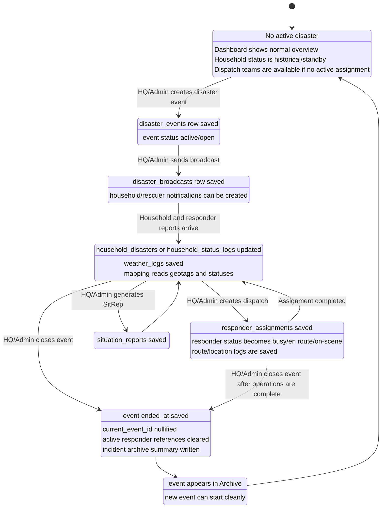
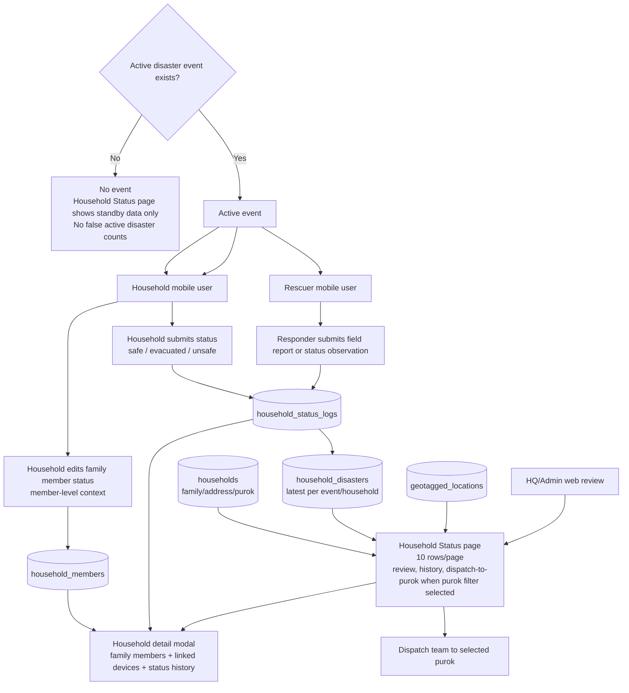
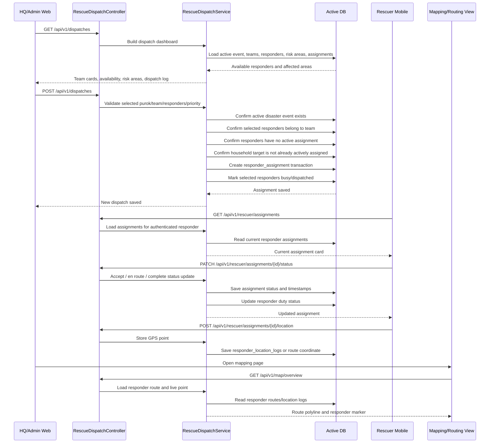
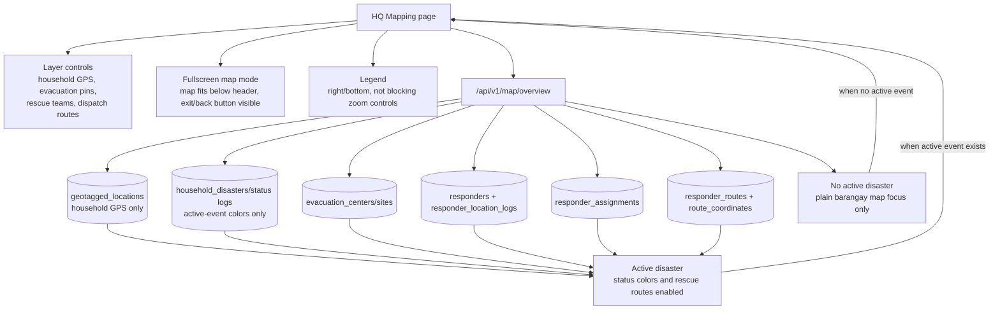

# 04 - Disaster, Household Status, Dispatch, and Mapping

## 4.1 Disaster Event Lifecycle

## 4.2 Household Status Data Flow

## 4.3 Rescue Dispatch Workflow

## 4.4 Mapping Layer and Routing Flow

## 4.5 Map Marker Meaning

| Marker/Layer | Source | Display Rule |
| --- | --- | --- |
| Plain barangay map | Map tiles + barangay profile | Always visible |
| Household GPS markers | `geotagged_locations` linked to households | Only if household has saved GPS |
| Safe marker | Latest active-event household status | Green/safe tone |
| Evacuated marker | Latest active-event household status | Blue/evacuated tone |
| Unsafe marker | Latest active-event household status | Red/urgent tone |
| Unchecked marker | Household in scope without current report | Neutral tone |
| Rescue team marker | Responder location logs | Shows active responder/team movement |
| Dispatch route | Route/coordinate tables or route service result | Drawn as polyline with direction hints |
| Evacuation pin | Evacuation center/site tables | Route target and reference point |

