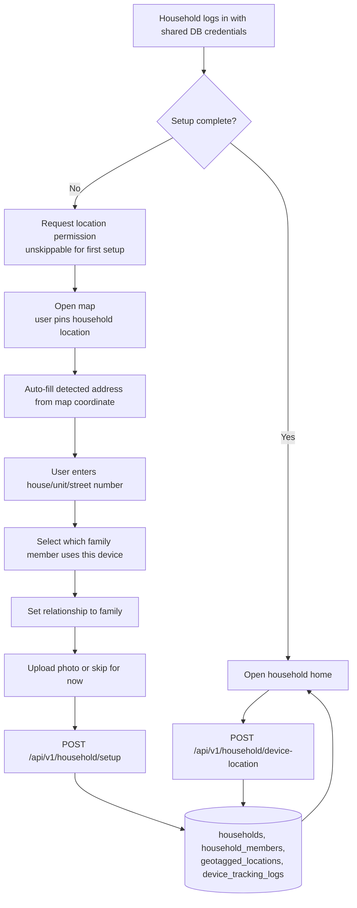
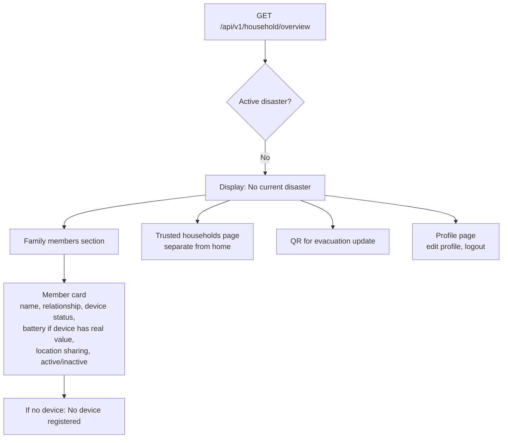
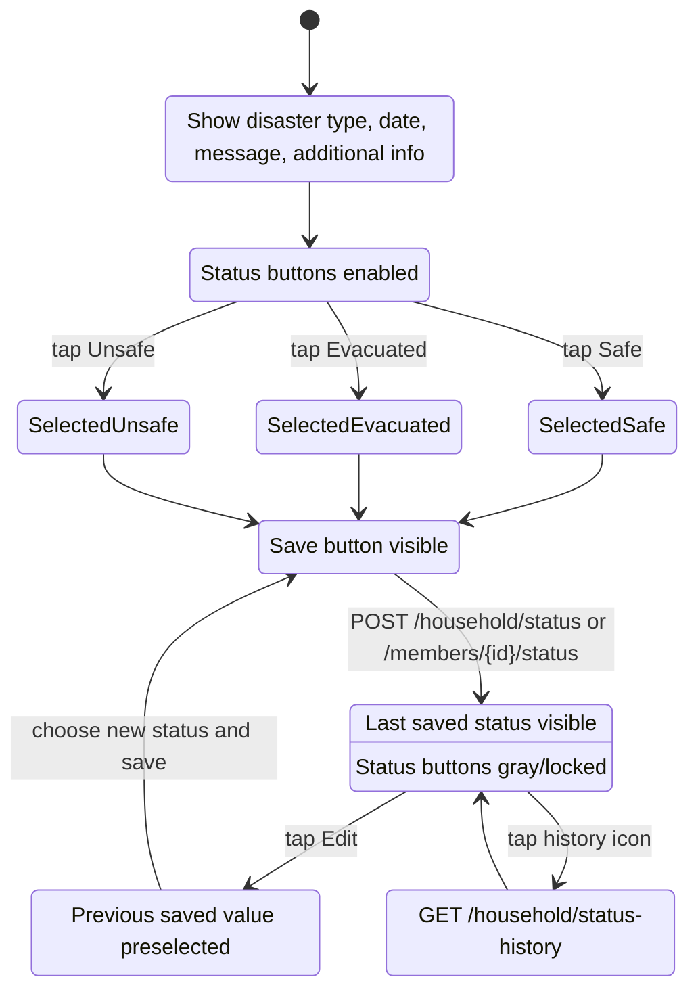
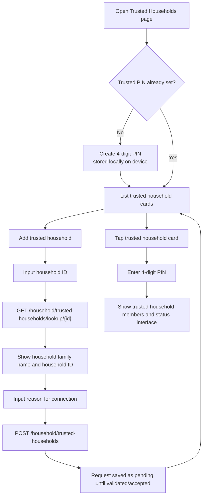
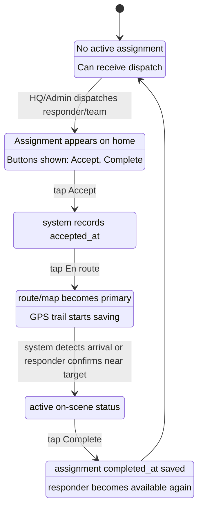
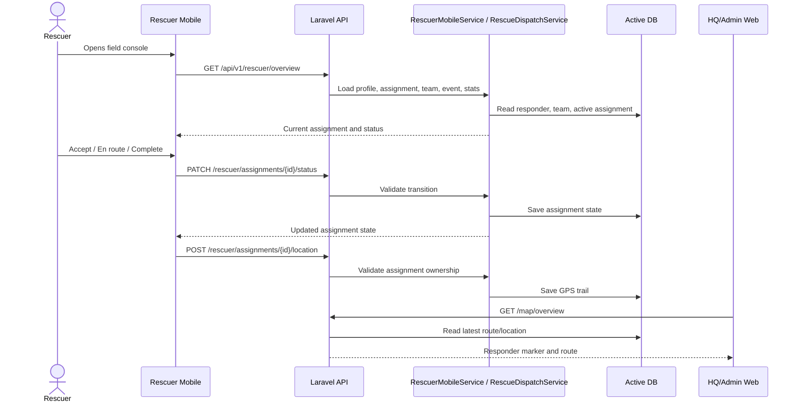
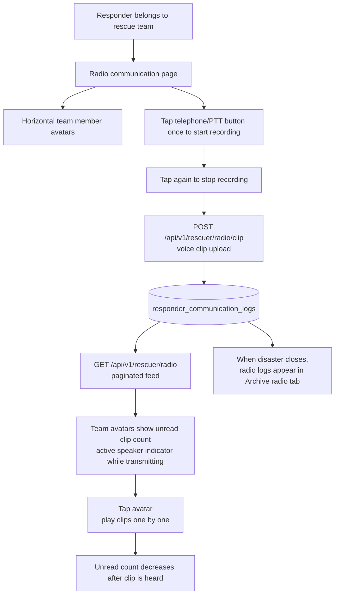

# 05 - Mobile Workflows: Household, Rescuer, and Radio

## 5.1 Household Mobile First-Time Setup

## 5.2 Household Home: No Active Disaster

## 5.3 Household Home: Active Disaster Status Update

## 5.4 Trusted Household Flow

## 5.5 Rescuer Mobile Assignment Flow

## 5.6 Rescuer Mobile Data Flow

## 5.7 Rescuer Radio / Push-to-Talk Clip Flow

