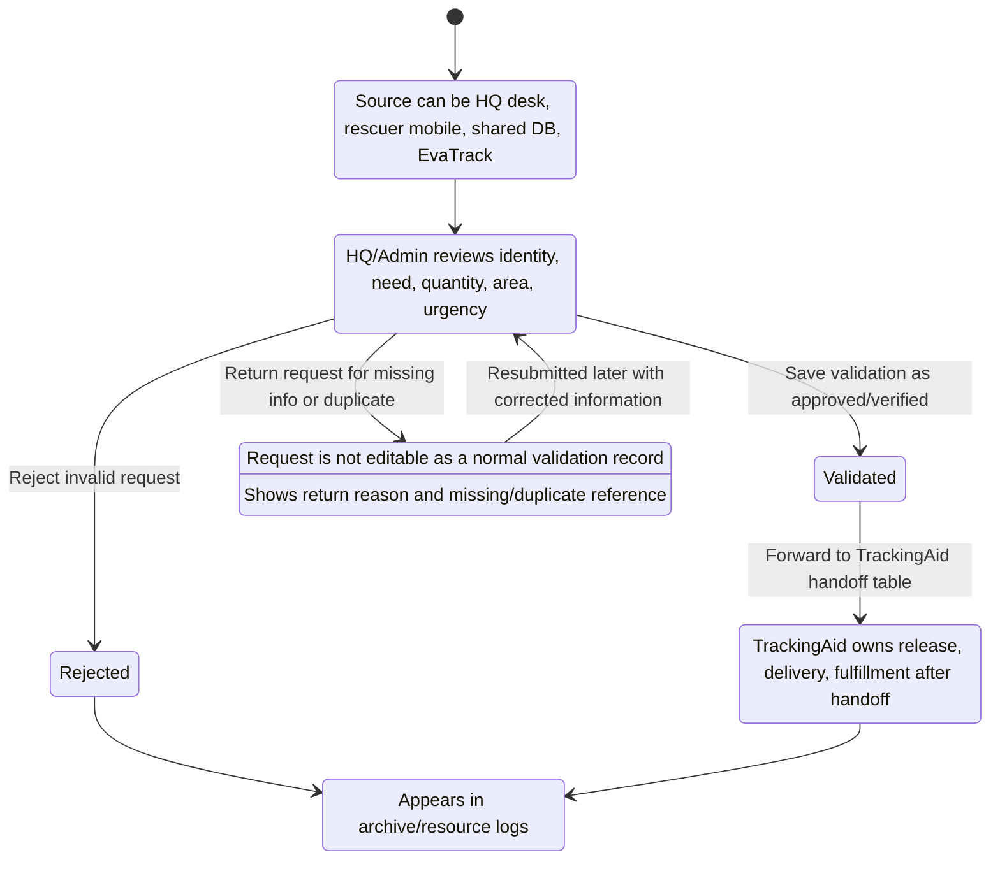
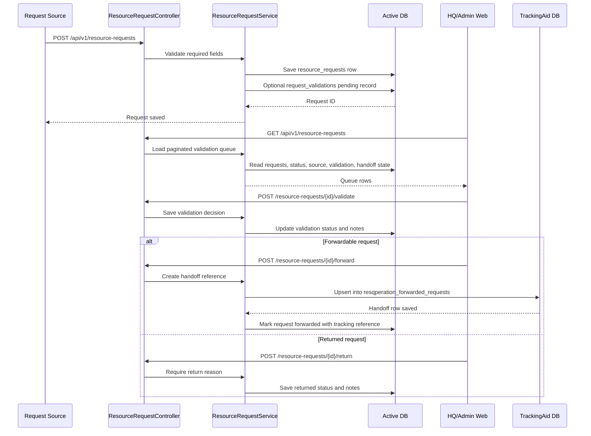
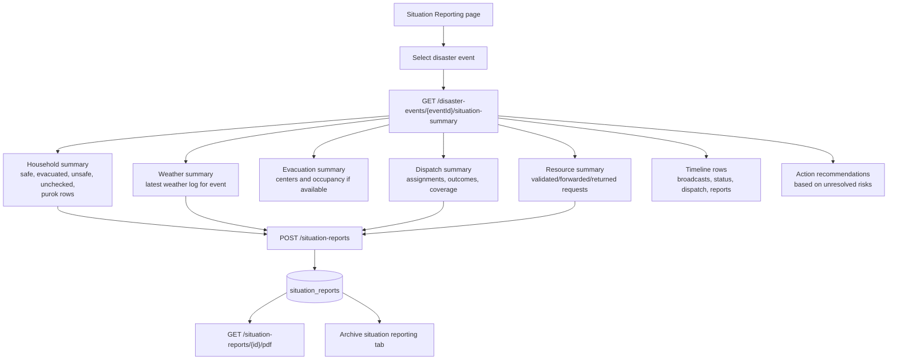
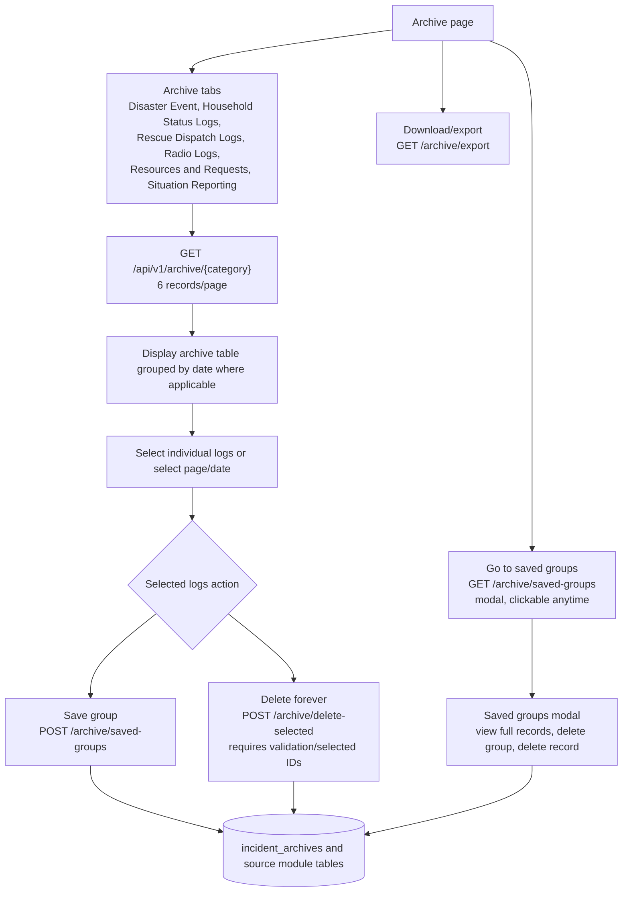
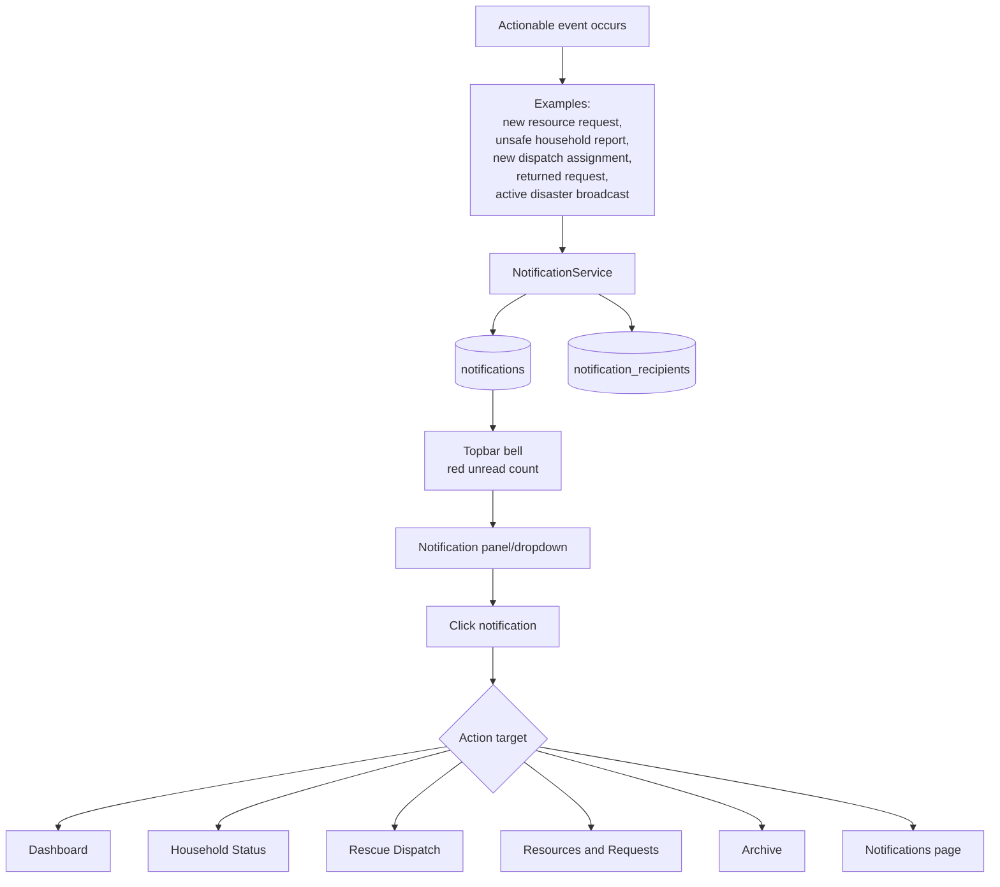

# 06 - Resource Requests, Situation Reports, Archive, and Notifications

## 6.1 Resource Request Validation Flow

## 6.2 Resource Request System Sequence

## 6.3 Situation Reporting Flow

## 6.4 Archive and Saved Groups Flow

## 6.5 Notification Flow

## 6.6 Archive Category Sources

| Archive Tab | Main Source Tables | Why It Matters |
| --- | --- | --- |
| Disaster Event | `disaster_events`, `disaster_broadcasts`, `weather_logs`, `household_disasters` | Event summary and closure history |
| Household Status Logs | `household_status_logs`, `household_disasters`, `households` | Household safety audit trail |
| Rescue Dispatch Logs | `responder_assignments`, `responders`, `rescue_teams`, route/location logs | Response operations audit |
| Radio Logs | `responder_communication_logs` | Team coordination history during event |
| Resources and Requests | `resource_requests`, `request_validations`, handoff fields | Validation and external handoff proof |
| Situation Reporting | `situation_reports` | Official generated situation summaries |

