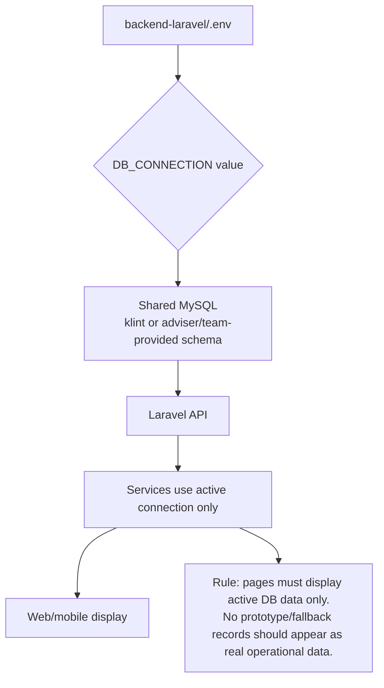
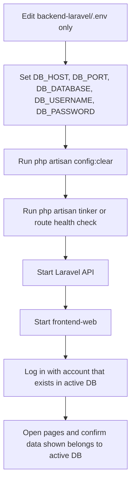

# 07 - Data Model and Database Scope

## 7.1 Database Scope Rule

## 7.2 Detailed ERD-Style Relationship Map

```mermaid
erDiagram
  ROLES ||--o{ USERS : assigned_to
  USERS ||--o{ PERSONAL_ACCESS_TOKENS : authenticates
  USERS ||--o{ NOTIFICATION_RECIPIENTS : receives
  NOTIFICATIONS ||--o{ NOTIFICATION_RECIPIENTS : targets
  NOTIFICATION_STATUSES ||--o{ NOTIFICATION_RECIPIENTS : marks

  REGIONS ||--o{ PROVINCES : has
  PROVINCES ||--o{ CITIES : has
  CITIES ||--o{ BARANGAYS : has
  BARANGAYS ||--o{ SITIOS : has
  SITIOS ||--o{ PUROKS : has
  BARANGAYS ||--o{ ADDRESSES : contains
  ADDRESSES ||--o{ HOUSEHOLDS : locates
  PUROKS ||--o{ HOUSEHOLDS : groups
  SITIOS ||--o{ HOUSEHOLDS : groups

  HOUSEHOLDS ||--o{ HOUSEHOLD_MEMBERS : has
  RELATIONSHIPS ||--o{ HOUSEHOLD_MEMBERS : describes
  GENDERS ||--o{ HOUSEHOLD_MEMBERS : classifies
  CIVIL_STATUSES ||--o{ HOUSEHOLD_MEMBERS : classifies
  OCCUPATIONS ||--o{ HOUSEHOLD_MEMBERS : classifies
  EDUCATION_LEVELS ||--o{ HOUSEHOLD_MEMBERS : classifies
  HOUSEHOLD_MEMBERS ||--o{ MEMBER_VULNERABLE_GROUPS : tagged_as
  VULNERABLE_GROUPS ||--o{ MEMBER_VULNERABLE_GROUPS : contains

  HOUSEHOLDS ||--o{ GEOTAGGED_LOCATIONS : pins
  HOUSEHOLD_MEMBERS ||--o{ DEVICE_TRACKING_LOGS : reports_device
  USERS ||--o{ DEVICE_TOKENS : owns

  DISASTER_TYPES ||--o{ DISASTER_EVENTS : categorizes
  DISASTER_EVENT_TYPES ||--o{ DISASTER_EVENTS : categorizes
  SEVERITY_LEVELS ||--o{ DISASTER_EVENTS : sets
  DISASTER_EVENTS ||--o{ DISASTER_BROADCASTS : sends
  DISASTER_EVENTS ||--o{ WEATHER_LOGS : records
  DISASTER_EVENTS ||--o{ HOUSEHOLD_DISASTERS : scopes
  HOUSEHOLDS ||--o{ HOUSEHOLD_DISASTERS : participates
  HOUSEHOLD_STATUSES ||--o{ HOUSEHOLD_DISASTERS : current_status
  HOUSEHOLDS ||--o{ HOUSEHOLD_STATUS_LOGS : submits
  DISASTER_EVENTS ||--o{ HOUSEHOLD_STATUS_LOGS : receives

  RESCUE_TEAMS ||--o{ RESPONDERS : contains
  USERS ||--o{ RESPONDERS : login_profile
  RESPONDERS ||--o{ RESPONDER_ASSIGNMENTS : assigned
  RESCUE_TEAMS ||--o{ RESPONDER_ASSIGNMENTS : deployed
  DISASTER_EVENTS ||--o{ RESPONDER_ASSIGNMENTS : activates
  HOUSEHOLDS ||--o{ RESPONDER_ASSIGNMENTS : target_household
  RESPONDER_ASSIGNMENTS ||--o{ RESPONDER_ROUTES : has
  RESPONDER_ROUTES ||--o{ ROUTE_COORDINATES : has
  RESPONDERS ||--o{ RESPONDER_LOCATION_LOGS : reports
  RESPONDERS ||--o{ RESPONDER_CHECK_INS : logs
  RESPONDERS ||--o{ RESPONDER_COMMUNICATION_LOGS : sends
  DISASTER_EVENTS ||--o{ RESPONDER_COMMUNICATION_LOGS : archives_by_event

  FIELD_REPORT_CATEGORIES ||--o{ RESPONDER_FIELD_REPORTS : categorizes
  RESPONDERS ||--o{ RESPONDER_FIELD_REPORTS : submits
  DISASTER_EVENTS ||--o{ RESPONDER_FIELD_REPORTS : receives
  RESPONDER_FIELD_REPORTS ||--o{ RESPONDER_FIELD_REPORT_DETAILS : details
  FIELD_REPORT_CATEGORIES ||--o{ HQ_FIELD_REPORTS : categorizes
  DISASTER_EVENTS ||--o{ HQ_FIELD_REPORTS : receives

  RESOURCE_REQUEST_STATUS ||--o{ RESOURCE_REQUESTS : marks
  URGENCY_LEVELS ||--o{ RESOURCE_REQUESTS : prioritizes
  SEVERITY_LEVELS ||--o{ RESOURCE_REQUESTS : escalates
  DISASTER_EVENTS ||--o{ RESOURCE_REQUESTS : relates
  RESPONDERS ||--o{ RESOURCE_REQUESTS : may_request
  RESOURCE_REQUESTS ||--o{ REQUEST_VALIDATIONS : reviewed_by_hq
  RESOURCE_REQUESTS ||--o{ UNIT_ALLOCATIONS : may_allocate

  EVACUATION_CENTERS ||--o{ EVACUATION_RECORDS : records
  EVACUATION_CENTERS ||--o{ CENTER_OCCUPANCIES : has
  EVACUATION_RECORDS ||--o{ EVACUATED_MEMBERS : includes
  HOUSEHOLD_MEMBERS ||--o{ EVACUATED_MEMBERS : checked_in

  DISASTER_EVENTS ||--o{ SITUATION_REPORTS : summarizes
  DISASTER_EVENTS ||--o{ INCIDENT_ARCHIVES : closes_into
  USERS ||--o{ AUDIT_LOGS : performs
```

## 7.3 Module-to-Table Dependency Matrix

| Module | Main Tables Read | Main Tables Written |
| --- | --- | --- |
| Authentication | `users`, `roles`, `responders`, `households`, SafeTrack-related tables | `personal_access_tokens` |
| Dashboard | `disaster_events`, `households`, `household_disasters`, `responder_assignments`, `weather_logs`, `resource_requests` | `incident_archives`, audit logs on event close |
| Disaster Broadcasting | `disaster_events`, `disaster_types`, `severity_levels`, `puroks`, `households` | `disaster_events`, `disaster_broadcasts`, notifications |
| Weather Updates | `disaster_events`, `weather_logs`, barangay profile data | `weather_logs` |
| Mapping | `geotagged_locations`, `household_disasters`, `evacuation_centers`, `responders`, `responder_assignments`, routes | route/location logs when generated or updated |
| Household Status | `households`, `household_members`, `household_disasters`, `household_status_logs`, geotags | status logs only from household/rescuer routes |
| Rescue Dispatch | `rescue_teams`, `responders`, `household_disasters`, `responder_assignments` | assignments, route coordinates, responder duty status, audit logs |
| Rescuer Accounts | `responders`, `rescue_teams`, `users`, `roles` | responder accounts, team config, user login records |
| Resources and Requests | `resource_requests`, request lookup tables, validation/handoff data | request validations, returned/forwarded states |
| Situation Reporting | event, weather, household, dispatch, resource tables | `situation_reports` |
| Archive | all operational log/source tables | saved groups, delete operations, exports |
| Mobile Household | household, member, geotag, trusted household, status tables | setup, device location, member/status updates |
| Mobile Rescuer | responder, assignment, route, report, request, radio tables | assignment status, GPS, reports, requests, radio logs |

## 7.4 Active DB Switching Checklist

