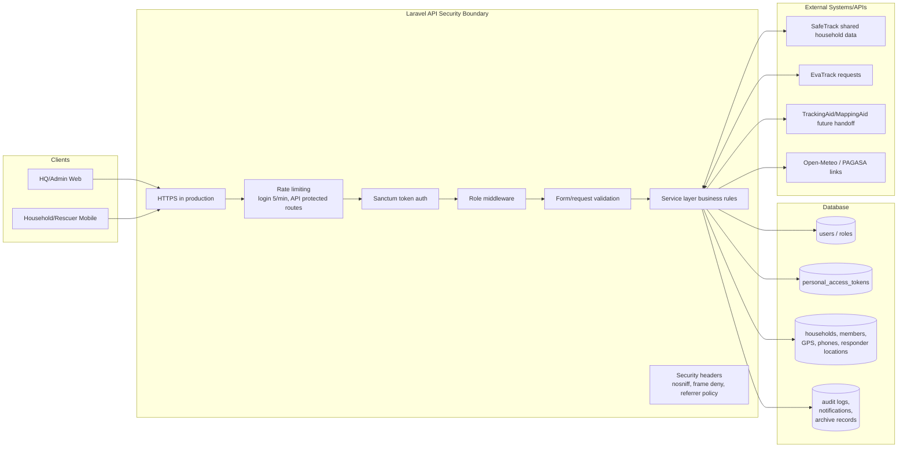
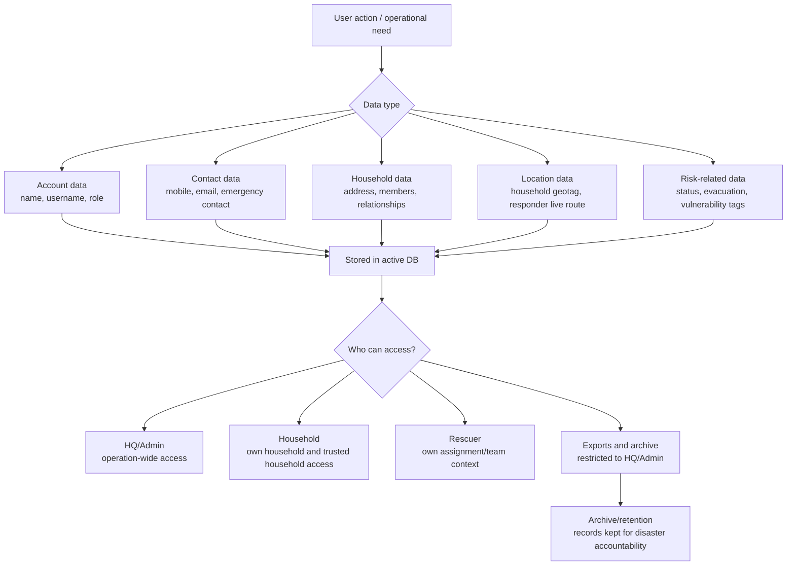
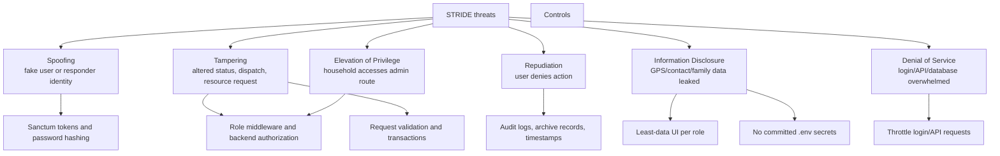

# 08 - SSDLC, Security, and Data Privacy

## 8.1 RESQPERATION SSDLC Flow

This diagram follows the SSDLC framework document and maps security activities to the actual project work.

```mermaid
flowchart TD
  R["1. Requirements\nDefine functional + security requirements"]
  R1["Identify sensitive data:\nGPS, household identity, phone numbers,\nfamily members, responder location"]
  R2["Define role access:\nHQ/Admin, household, rescuer"]
  R3["Define external trust boundaries:\nSafeTrack, EvaTrack, TrackingAid/MappingAid,\nOpen-Meteo, PAGASA"]

  D["2. Design\nThreat modeling and secure architecture"]
  D1["Use Laravel API as gatekeeper\nno direct frontend DB access"]
  D2["Use role middleware and Sanctum tokens"]
  D3["Use .env for shared DB connection only"]
  D4["Do not use prototype HTML as production backend"]

  DEV["3. Development\nSecure coding"]
  DEV1["Request validation before writes"]
  DEV2["Service classes hold business logic"]
  DEV3["Prepared DB queries/query builder"]
  DEV4["Password hashes, not plaintext passwords"]
  DEV5["Readable validation errors"]

  T["4. Testing\nFunctional + security testing"]
  T1["Login/role test cases"]
  T2["CRUD persistence tests"]
  T3["Unauthorized access tests"]
  T4["Dependency audit checks"]
  T5["Manual network/DB connectivity tests"]

  DEP["5. Deployment\nSecure configuration"]
  DEP1["APP_DEBUG=false for production"]
  DEP2["HTTPS in production"]
  DEP3["Security headers"]
  DEP4["Rate limiting login/API"]
  DEP5["Do not commit .env secrets"]

  M["6. Maintenance\nMonitoring and response"]
  M1["Audit logs and operation logs"]
  M2["Archive disaster-event evidence"]
  M3["Patch dependencies"]
  M4["Incident response and backup plan"]

  R --> R1 --> R2 --> R3 --> D
  D --> D1 --> D2 --> D3 --> D4 --> DEV
  DEV --> DEV1 --> DEV2 --> DEV3 --> DEV4 --> DEV5 --> T
  T --> T1 --> T2 --> T3 --> T4 --> T5 --> DEP
  DEP --> DEP1 --> DEP2 --> DEP3 --> DEP4 --> DEP5 --> M
  M --> M1 --> M2 --> M3 --> M4
```

## 8.2 Security Architecture Diagram

## 8.3 Data Privacy Flow

## 8.4 STRIDE Threat Model Summary

## 8.5 Defense Points for Security

- The frontend never connects directly to MySQL.
- The Laravel API is the single access control boundary.
- Authentication uses API tokens through Laravel Sanctum.
- Passwords must be stored as hashes.
- Role checks happen in the backend, not only in React/Expo.
- Requests are validated before database writes.
- GPS, household, and responder data are sensitive under Data Privacy Act principles.
- The system should show only the data needed by each role.
- Exports and archive deletion must remain HQ/Admin-only.
- Shared DB access must be configured through `.env`; credentials should not be committed.
