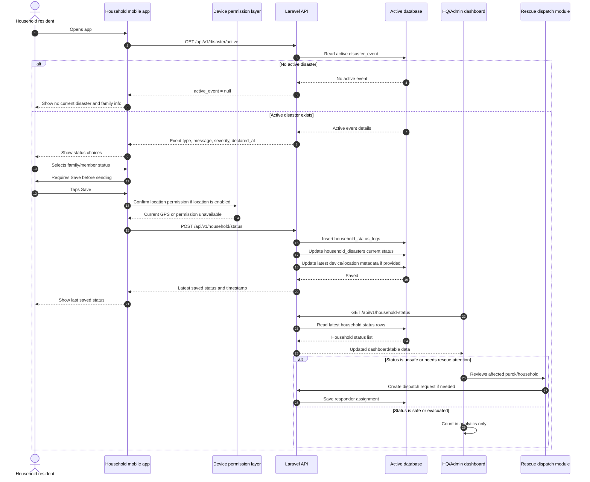

# 10 - Household Status Reporting Simulation

This diagram shows the simulated end-to-end household status reporting process during an active disaster event.

## Data saved by the simulation

- `household_status_logs`: every submitted status change.
- `household_disasters`: latest household status for the active event.
- `geotagged_locations` or device tracking tables: location source when available.
- Notification/audit tables: only if the action creates an actionable follow-up.

