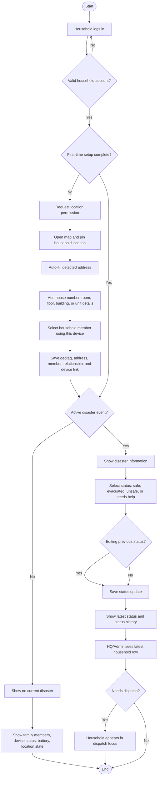

# 11 - Household Status Flow

This diagram focuses on the household mobile user journey from login to status reporting.

## Required privacy behavior

- Location setup must ask permission before collecting GPS data.
- The address must support high-density housing such as apartments, floors, rooms, and rented units.
- Rescuers should only see the address details needed for rescue routing and identification.
- Household GPS and address data must not be shown to unauthorized roles.

