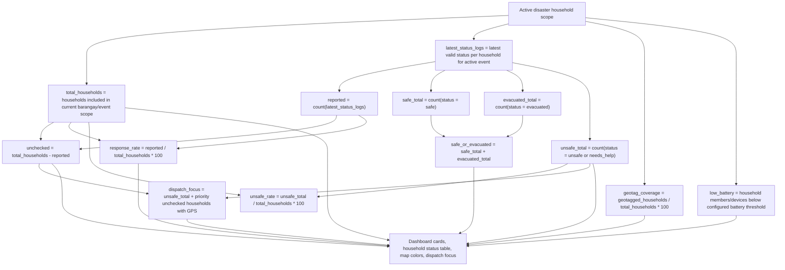

# 12 - Household Analytics Formula

This diagram documents how the household status dashboard counts and percentages should be computed.

## Display rules

- Do not count old disaster records in active event analytics.
- Do not show prototype or fallback data as real operational data.
- If no active disaster exists, disaster-specific household status colors should not be treated as current response data.
- The map should show neutral geotagged households when there is no active disaster.

