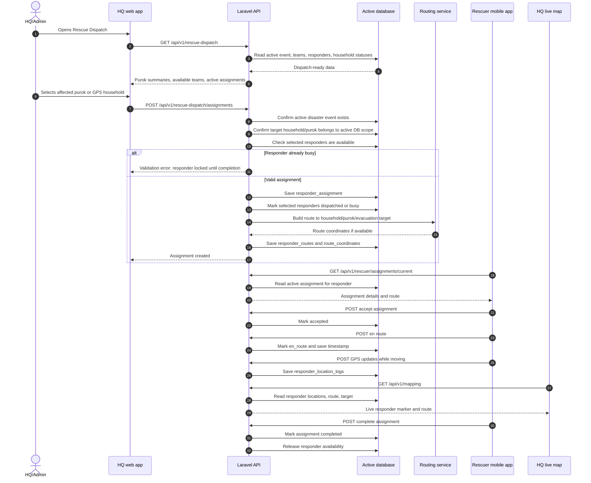

# 13 - Rescuer Dispatching Flow

This diagram shows the dispatch lifecycle from HQ/Admin selection to rescuer completion.

## Dispatch rules

- Only available responders should be selectable.
- A responder with an active assignment cannot receive another assignment until completed.
- If the disaster event is closed, active assignments should be reset or closed and responders should return to normal availability.
- Purok selection should update the assigned area automatically.

