# 14 - RESQPERATION Scope ERD

This ERD is limited to the RESQPERATION system scope. External systems are shown as integration sources/targets only, without listing their internal tables.

```mermaid
erDiagram
  SAFETRACK_EXTERNAL ||--o{ USERS : provides_household_accounts
  EVATRACK_EXTERNAL ||--o{ RESOURCE_REQUESTS : sends_requests
  TRACKINGAID_EXTERNAL ||--o{ RESOURCE_REQUESTS : receives_validated_requests
  WEATHER_SOURCES ||--o{ WEATHER_LOGS : provides_snapshots

  ROLES ||--o{ USERS : assigned_to
  USERS ||--o{ PERSONAL_ACCESS_TOKENS : authenticates
  USERS ||--o{ DEVICE_TOKENS : owns
  USERS ||--o{ NOTIFICATIONS : receives_or_creates

  BARANGAYS ||--o{ SITIOS : contains
  SITIOS ||--o{ PUROKS : contains
  BARANGAYS ||--o{ HOUSEHOLDS : contains
  PUROKS ||--o{ HOUSEHOLDS : groups

  HOUSEHOLDS ||--o{ HOUSEHOLD_MEMBERS : has
  HOUSEHOLDS ||--o{ GEOTAGGED_LOCATIONS : pins
  HOUSEHOLDS ||--o{ TRUSTED_HOUSEHOLDS : links_to
  HOUSEHOLDS ||--o{ HOUSEHOLD_DISASTERS : scoped_in
  HOUSEHOLDS ||--o{ HOUSEHOLD_STATUS_LOGS : reports

  DISASTER_TYPES ||--o{ DISASTER_EVENTS : classifies
  SEVERITY_LEVELS ||--o{ DISASTER_EVENTS : rates
  DISASTER_EVENTS ||--o{ DISASTER_BROADCASTS : broadcasts
  DISASTER_EVENTS ||--o{ HOUSEHOLD_DISASTERS : tracks
  DISASTER_EVENTS ||--o{ HOUSEHOLD_STATUS_LOGS : receives
  DISASTER_EVENTS ||--o{ RESPONDER_ASSIGNMENTS : dispatches
  DISASTER_EVENTS ||--o{ RESOURCE_REQUESTS : includes
  DISASTER_EVENTS ||--o{ WEATHER_LOGS : snapshots
  DISASTER_EVENTS ||--o{ SITUATION_REPORTS : summarizes
  DISASTER_EVENTS ||--o{ INCIDENT_ARCHIVES : archives
  DISASTER_EVENTS ||--o{ RESPONDER_COMMUNICATION_LOGS : groups_radio_logs

  RESCUE_TEAMS ||--o{ RESPONDERS : contains
  USERS ||--o{ RESPONDERS : login_profile
  RESPONDERS ||--o{ RESPONDER_ASSIGNMENTS : assigned_to
  RESPONDERS ||--o{ RESPONDER_LOCATION_LOGS : reports_location
  RESPONDERS ||--o{ RESPONDER_FIELD_REPORTS : submits
  RESPONDERS ||--o{ RESPONDER_COMMUNICATION_LOGS : sends_radio

  RESPONDER_ASSIGNMENTS ||--o{ RESPONDER_ROUTES : has_route
  RESPONDER_ROUTES ||--o{ ROUTE_COORDINATES : contains
  RESPONDER_ASSIGNMENTS ||--o{ RESPONDER_FIELD_REPORTS : may_reference

  RESOURCE_REQUEST_STATUS ||--o{ RESOURCE_REQUESTS : marks
  URGENCY_LEVELS ||--o{ RESOURCE_REQUESTS : prioritizes
  RESOURCE_REQUESTS ||--o{ REQUEST_VALIDATIONS : reviewed_by_hq

  EVACUATION_CENTERS ||--o{ EVACUATION_RECORDS : records
  HOUSEHOLD_MEMBERS ||--o{ EVACUATION_RECORDS : checked_in
```

## Scope rule

The ERD excludes internal SafeTrack, EvaTrack, and TrackingAid-owned tables. RESQPERATION only documents the records it reads, writes, validates, or forwards.

