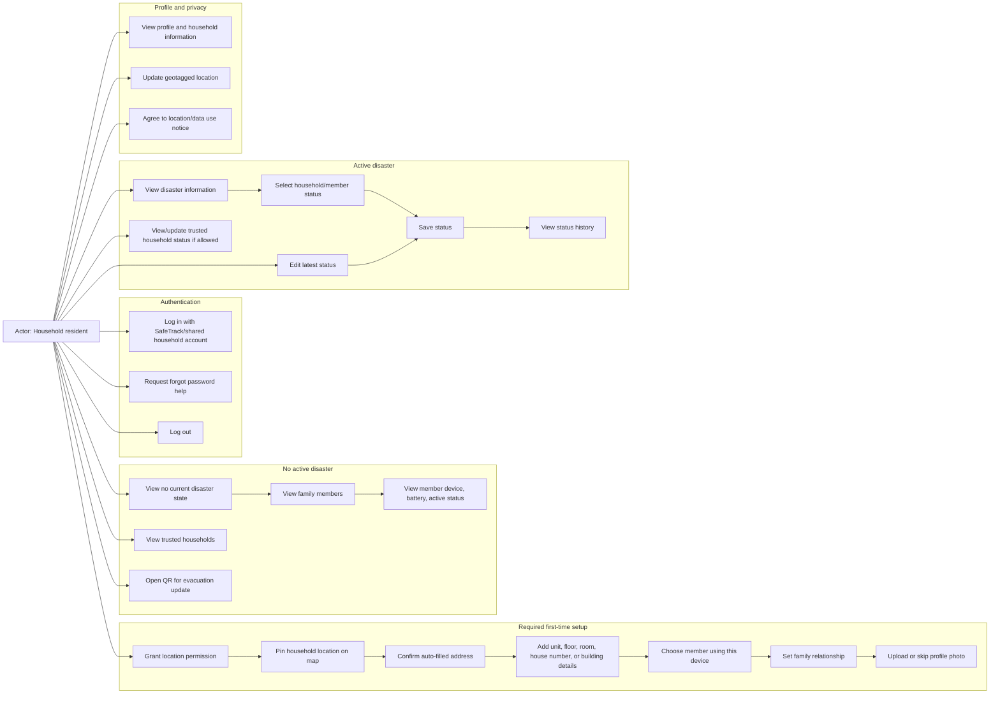

# 15 - Household Use Case

```mermaid
flowchart LR
  Household["Actor: Household resident"]

  subgraph Auth["Authentication"]
    Login["Log in with SafeTrack/shared household account"]
    Forgot["Request forgot password help"]
    Logout["Log out"]
  end

  subgraph Setup["Required first-time setup"]
    Permission["Grant location permission"]
    Pin["Pin household location on map"]
    Address["Confirm auto-filled address"]
    Unit["Add unit, floor, room, house number, or building details"]
    Member["Choose member using this device"]
    Relationship["Set family relationship"]
    Photo["Upload or skip profile photo"]
  end

  subgraph Home["No active disaster"]
    NoEvent["View no current disaster state"]
    Family["View family members"]
    Device["View member device, battery, active status"]
    Trusted["View trusted households"]
    QR["Open QR for evacuation update"]
  end

  subgraph Disaster["Active disaster"]
    Alert["View disaster information"]
    Status["Select household/member status"]
    Save["Save status"]
    Edit["Edit latest status"]
    History["View status history"]
    TrustedStatus["View/update trusted household status if allowed"]
  end

  subgraph Profile["Profile and privacy"]
    ProfileView["View profile and household information"]
    GeoUpdate["Update geotagged location"]
    Privacy["Agree to location/data use notice"]
  end

  Household --> Login
  Household --> Forgot
  Household --> Logout
  Household --> Permission --> Pin --> Address --> Unit --> Member --> Relationship --> Photo
  Household --> NoEvent --> Family --> Device
  Household --> Trusted
  Household --> QR
  Household --> Alert --> Status --> Save --> History
  Household --> Edit --> Save
  Household --> TrustedStatus
  Household --> ProfileView
  Household --> GeoUpdate
  Household --> Privacy
```

