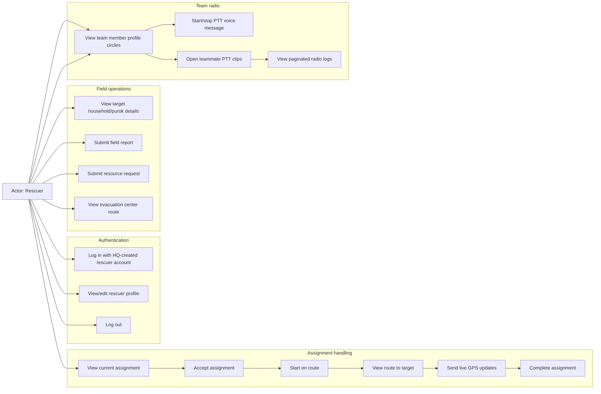

# 16 - Rescuer Use Case

```mermaid
flowchart LR
  Rescuer["Actor: Rescuer"]

  subgraph Auth["Authentication"]
    Login["Log in with HQ-created rescuer account"]
    Profile["View/edit rescuer profile"]
    Logout["Log out"]
  end

  subgraph Assignment["Assignment handling"]
    ViewAssignment["View current assignment"]
    Accept["Accept assignment"]
    EnRoute["Start en route"]
    Route["View route to target"]
    GPS["Send live GPS updates"]
    Complete["Complete assignment"]
  end

  subgraph FieldOps["Field operations"]
    HouseholdTarget["View target household/purok details"]
    FieldReport["Submit field report"]
    ResourceRequest["Submit resource request"]
    EvacRoute["View evacuation center route"]
  end

  subgraph Radio["Team radio"]
    TeamList["View team member profile circles"]
    Record["Start/stop PTT voice message"]
    Listen["Open teammate PTT clips"]
    RadioLogs["View paginated radio logs"]
  end

  Rescuer --> Login
  Rescuer --> Profile
  Rescuer --> Logout
  Rescuer --> ViewAssignment --> Accept --> EnRoute --> Route --> GPS --> Complete
  Rescuer --> HouseholdTarget
  Rescuer --> FieldReport
  Rescuer --> ResourceRequest
  Rescuer --> EvacRoute
  Rescuer --> TeamList --> Record
  Rescuer --> TeamList --> Listen --> RadioLogs
```

