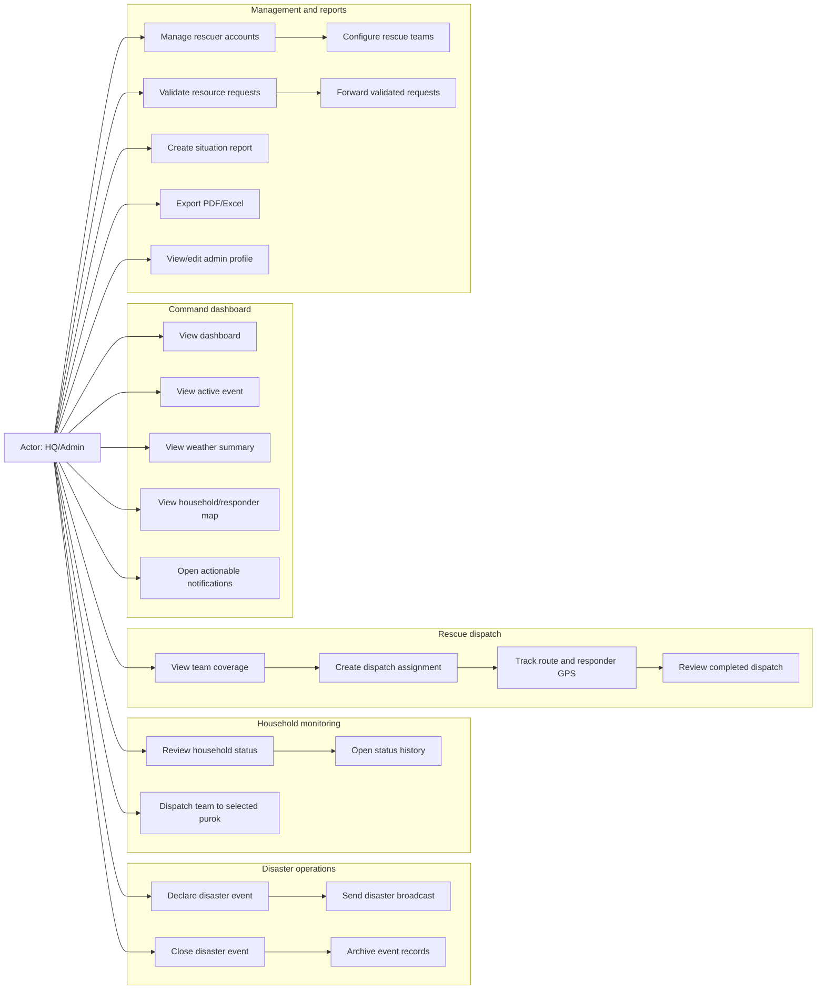

# 17 - HQ/Admin Web Use Case

```mermaid
flowchart LR
  Admin["Actor: HQ/Admin"]

  subgraph Command["Command dashboard"]
    Dashboard["View dashboard"]
    ActiveEvent["View active event"]
    WeatherSummary["View weather summary"]
    MapSummary["View household/responder map"]
    Notifications["Open actionable notifications"]
  end

  subgraph Disaster["Disaster operations"]
    Declare["Declare disaster event"]
    Broadcast["Send disaster broadcast"]
    EndEvent["Close disaster event"]
    ArchiveEvent["Archive event records"]
  end

  subgraph Status["Household monitoring"]
    HouseholdStatus["Review household status"]
    StatusHistory["Open status history"]
    DispatchPurok["Dispatch team to selected purok"]
  end

  subgraph Dispatch["Rescue dispatch"]
    DispatchView["View team coverage"]
    CreateDispatch["Create dispatch assignment"]
    TrackRoute["Track route and responder GPS"]
    CompleteReview["Review completed dispatch"]
  end

  subgraph Management["Management and reports"]
    Rescuers["Manage rescuer accounts"]
    Teams["Configure rescue teams"]
    Resources["Validate resource requests"]
    Forward["Forward validated requests"]
    SitRep["Create situation report"]
    Export["Export PDF/Excel"]
    Profile["View/edit admin profile"]
  end

  Admin --> Dashboard
  Admin --> ActiveEvent
  Admin --> WeatherSummary
  Admin --> MapSummary
  Admin --> Notifications
  Admin --> Declare --> Broadcast
  Admin --> EndEvent --> ArchiveEvent
  Admin --> HouseholdStatus --> StatusHistory
  Admin --> DispatchPurok
  Admin --> DispatchView --> CreateDispatch --> TrackRoute --> CompleteReview
  Admin --> Rescuers --> Teams
  Admin --> Resources --> Forward
  Admin --> SitRep
  Admin --> Export
  Admin --> Profile
```

