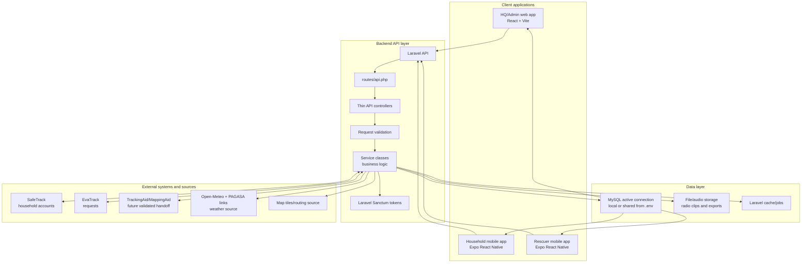

# 18 - System Architecture

## Architecture rules

- Only `backend-laravel/.env` should change when switching database connections.
- Web and mobile clients must call the API, not the database directly.
- Controllers should stay small and delegate logic to services.
- Pages should display active database records only.

