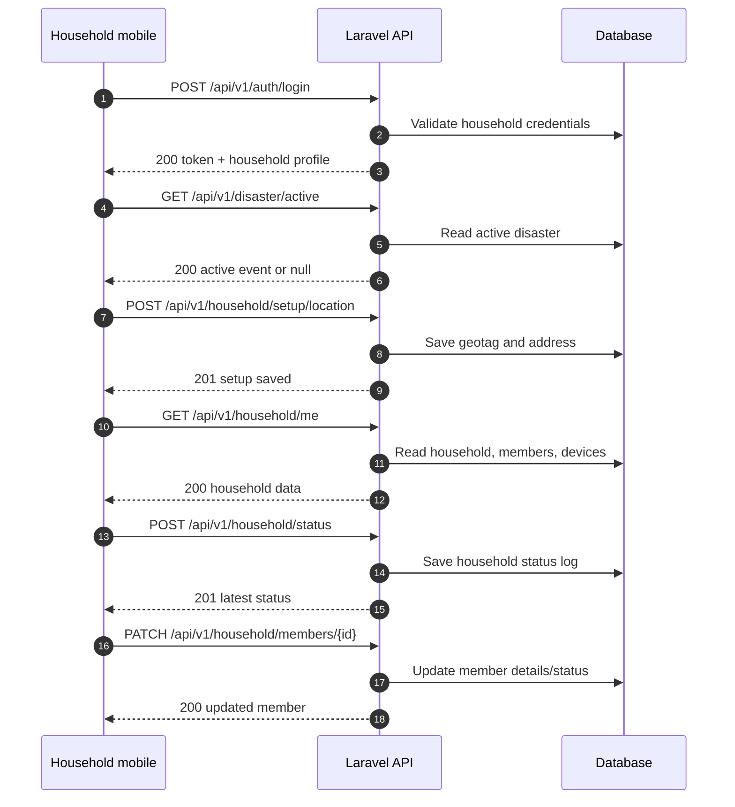
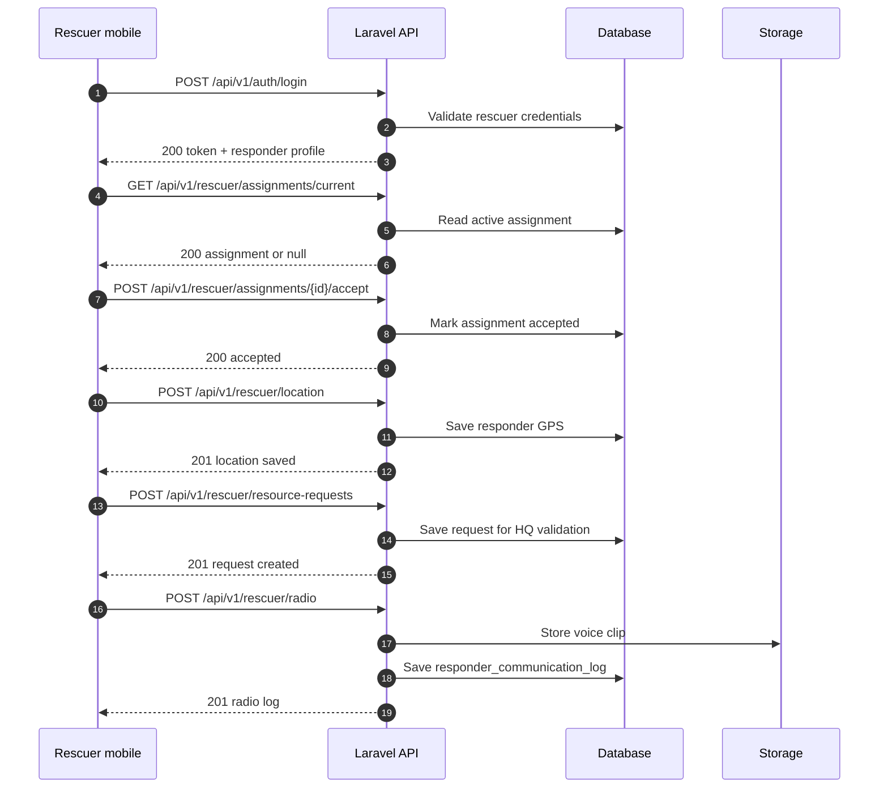
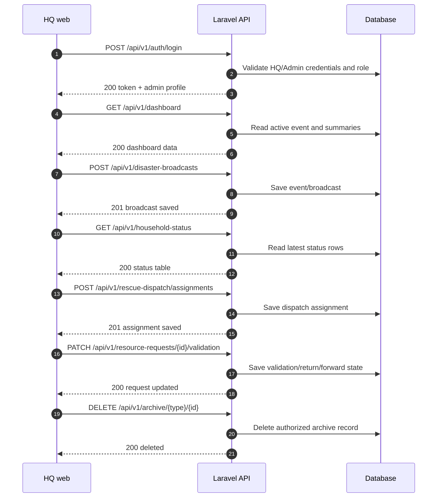

# 19 - HTTP Request Methods Process

This file separates the request method flow for Household Mobile, Rescuer Mobile, and HQ/Admin Web.

## 19.1 Household Mobile HTTP Flow

## 19.2 Rescuer Mobile HTTP Flow

## 19.3 HQ/Admin Web HTTP Flow

