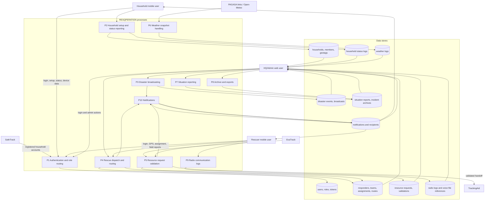

# 20 - Data Flow Diagram

## Data flow constraints

- Household records originate from the active database connection and SafeTrack-shared account data.
- EvaTrack and TrackingAid are integration partners, not owned internal modules.
- Weather snapshots are operational references; official warnings still require PAGASA confirmation.
- Archive/export operations must respect role access.

