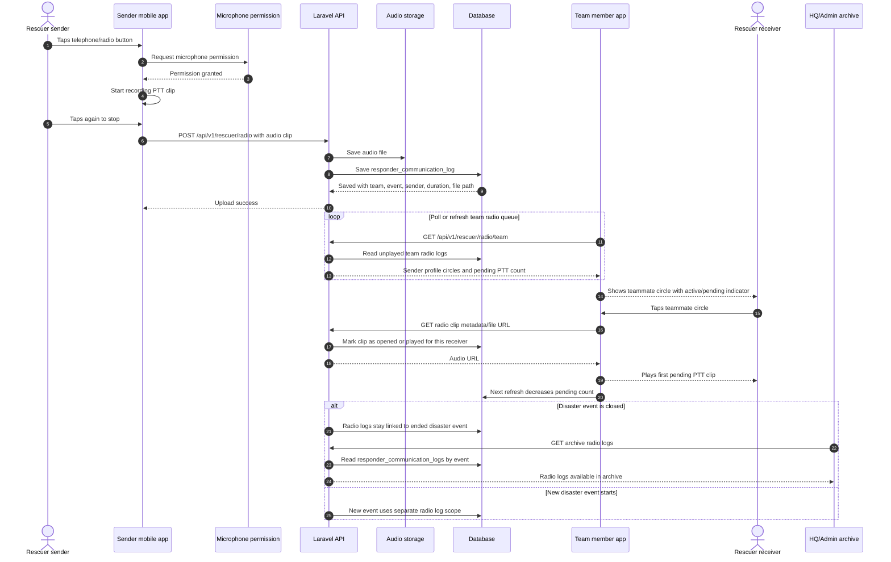

# 21 - Radio Communication Flow

This diagram documents the rescuer mobile radio communication flow. The current beginner-friendly implementation is voice-clip based rather than continuous live WebRTC.

## Radio behavior rules

- Only members of the same rescue team should receive team radio clips.
- The indicator should show who sent audio and how many unplayed clips exist.
- Logs should be paginated instead of loading all records at once.
- Radio logs should remain available in the event archive after disaster closure.
- If live push is added later, this flow can be upgraded to WebSocket/WebRTC while keeping database logs.

